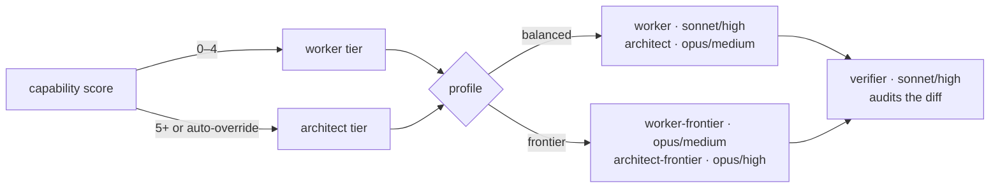

# BigIn Skills

**A plugin for Claude Code and Cursor, for AI-assisted development.**

The agent writes a spec before it writes code. A second, memoryless agent audits the diff against that spec — never against the first agent's account of what it did. Commit-time hooks enforce both mechanically, rather than as prose in a doc nobody reads.

| | |
| --- | --- |
| **Start here** | [Handbook](https://bigin-skills.pages.dev/handbook) — why the harness exists and the five concepts behind it, in one readable pass (source: [`site/src/pages/handbook.html`](site/src/pages/handbook.html)) |
| **Day to day** | [User Guide](docs/USER_GUIDE.md) — setup, the daily loop, what each gate blocks and how to unblock it, troubleshooting |
| **Going deeper** | [Spec gate](docs/SPEC-GATE.md) · [Enforcement gates](docs/GATES.md) · [Model routing](docs/ROUTING.md) · [Knowledge bundle](docs/KNOWLEDGE.md) · [Code graph](docs/GRAPHIFY.md) |
| **Multi-repo projects** | [Polyrepo standard](docs/polyrepo/README.md) — the six-repo project layout, contract vendoring, story sync, and the repo types the harness installs for each |

---

## Install

**Claude Code**

```
/plugin marketplace add tammai/bigin-skills
/plugin install bigin-skills@bigin
```

`npx skills add tammai/bigin-skills` installs the skills alone: no subagents (so no verifier and no routing tiers), no plugin hooks, and the `${CLAUDE_PLUGIN_ROOT}` paths skills use to reach each other don't resolve. Use it only to try a single standalone skill.

**Cursor**

```
/add-plugin
```

Then pick `bigin-skills` (or Customize → Plugins). For local development, symlink the checkout instead: `ln -s "$(pwd)" ~/.cursor/plugins/local/bigin-skills`.

Both hosts install the same tree — `.cursor-plugin/plugin.json` declares paths into the existing `skills/` and `agents/` directories, so there's one copy of everything. What differs: Cursor doesn't take the subagent ladder's per-tier `model`/`effort` pins, so `model-router`'s fan-out is Claude-Code-only. So are the plugin's SessionStart drift notice and the harness's `Setup` hook bootstrap, since Cursor has neither event. Every gate and skill works on both, with one difference: an agent edit to the gates' own files (guards, hook settings, git hooks) asks for approval in Claude Code but is denied outright by Cursor's editor hook, because that hook can't ask ([details](skills/bigin-harness-setup/references/cursor-parity.md)).

Install the whole plugin, not one skill: `bigin-harness-setup` reaches the sibling scaffold skills through `${CLAUDE_PLUGIN_ROOT}` (the plugin's install directory, not your repo), so its empty-repo scaffold branches need those siblings installed alongside it.

---

## The two things you run

**1. Once per repo — "set up a harness."** [`bigin-harness-setup`](skills/bigin-harness-setup/SKILL.md) lays down the governance layer: a ≤60-line `CLAUDE.md`, path-scoped `.claude/rules/`, the guard hooks, and the context-budget gate. On an empty repo it scaffolds the app first, delegating to the matching stack skill, then overlays governance additively. Idempotent — re-running is safe, and offers `patch` (apply only the changes since the version your repo was scaffolded with) or `verify` (install nothing; re-check every claim in the existing `CLAUDE.md` against the repo and correct what no longer holds). On a repo already using Spec Kit, it detects that and offers migrate / coexist / leave ([details](skills/bigin-harness-setup/references/speckit-migration.md)). If teammates work in Cursor, it also generates the Cursor mirror — `AGENTS.md`, `.cursor/rules/*.mdc`, `.cursor/hooks.json` — running the same guards off the same canonical files ([details](skills/bigin-harness-setup/references/cursor-parity.md)).

**2. Every day after — "implement X" / "fix bug in Y."** [`task-workflow`](skills/task-workflow/SKILL.md) is the main driver: scope → spec gate → approved `PLAN.md` → implement/verify loop (capped at 3 rounds, independent verifier) → review → cleanup. It's the discipline `spec-gate-guard.mjs` and `bugfix-test-guard.mjs` actually enforce. Cleanup archives the finished `PLAN.md` verbatim rather than deleting it, so *why* a change took its shape outlives the task. You'll run setup once and this dozens of times.

When a request is too big for one plan, [`epic-workflow`](skills/epic-workflow/SKILL.md) sits one level up: it decomposes the initiative into ordered, independently shippable units, drafts the epic's one-page design doc where the initiative earns one, gets both approved, and then hands the units back to `task-workflow` one at a time. It stops and asks for `/clear` after 2 units in one session (sooner if the context is already heavy, or the last unit changed something the next one inherits); re-invoking resumes from the queue. With an approved PRD on disk it decomposes straight from the requirement index and asks nothing. It adds no gate of its own — each unit still passes the spec gate on its own merits.

And when nobody can yet say what the thing *is*, [`discovery-workflow`](skills/discovery-workflow/SKILL.md) sits above both. Both skills below it take their subject as given — an initiative, a task — and this one produces it: an approved brief and a PRD with numbered, testable requirements under `docs/product/`, plus the architecture decisions the product forced, written into `knowledge/`. It is also the one skill that diverges before it narrows — it offers up to four *framings* of the idea, each with what it refuses to do, before anything gets written down. It triages the same way they do, so a one-line change goes straight to `task-workflow` with nothing written to disk.

Everything else is situational:

| You say | What runs |
| --- | --- |
| `/napkin how does the spec gate work` | `napkin` — a picture explainer: offers a few candidate shapes, then draws the one you pick as an HTML artifact, or as an SVG/PNG diagram when you say where it is going |
| `/ask-bigin which skill should I use` | `ask-bigin` — names the one that fits, says why in a line, and hands off. **Typed, never automatic**: if you can name the work, name it and skip the hop |
| _(automatic, inside task-workflow)_ | `model-router` picks the executing tier; `write-tests` and `debug-workflow` supply test and bug-fix discipline |
| "This is too big for one task" / "break this epic down" | `epic-workflow` — decomposes it into ordered units, then feeds them back to `task-workflow` one at a time |
| "We want to build X" / "write a PRD" / "what should we even build" | `discovery-workflow` — brief + PRD under `docs/product/`, architecture decisions into `knowledge/`, then hands the PRD to `epic-workflow` |
| "Write tests for X" / "e2e test for FR-3/AC-2" | `write-tests` — one function or component, or a test per PRD acceptance criterion at the lowest tier that can observe it (E2E only for a journey); no spec needed |
| "Why is this flaky" / "debug this" | `debug-workflow` — a bug not yet tied to a plan |
| "Sprint distill" / end of sprint | `sprint-distill` — merged PRs → `knowledge/` + harness updates |
| "Distill knowledge for nuxt@4.0.3" | `knowledge-distill` — a library's docs/source at a pinned version → audited `knowledge/libraries/<lib>/` |
| "Save session" / nearing a context limit | `session-handoff` |
| Implementing a Figma handoff in a Nuxt UI app | `nuxt-ui-figma-handoff` |
| "Absorb the contract bump" / "our openapi.yaml is stale" | `contract-sync` — vendors the contract at a pinned commit and regenerates the client; the only writer of the vendored spec and `api-contract.lock` |
| "Set up a new polyrepo project" / "scaffold the six repos" | `project-scaffold` — six repos, the right scaffold in each, locks and workflows wired between them; remotes and CI credentials opt-in |

### Stack profiles

Setup detects the profile, or asks. It decides which templates get written. `tauri` and `nuxt-marketing` are both checked before `nuxt`, since a repo on either carries the `nuxt.config.ts` marker too.

| Profile | Stack | Scaffold |
| --- | --- | --- |
| `nuxt` | Nuxt 4 SPA on Cloudflare Workers — Pinia + Colada, Nuxt UI, Zod, Vitest, behind a tokenless `/api` pass-through to the API (HttpOnly cookie session, no BFF). No DB; the backend owns data | `nuxt-scaffold` |
| `nuxt-marketing` | Multi-locale Nuxt 4 marketing site — `@nuxt/content` collections, `@nuxtjs/i18n`, Tailwind, prerendered onto Cloudflare Workers static assets. No auth, no BFF, no database; its `conventions-content.md` is the only rule file in any profile written for a non-developer editor | `nuxt-marketing-scaffold` |
| `next` | Next.js App Router on Cloudflare Workers (OpenNext) — shadcn/ui, Zustand, TanStack Query, Zod, Vitest, behind a tokenless `/api` pass-through to the API (HttpOnly cookie session, no BFF). No DB; the backend owns data | `next-scaffold` |
| `go` | Go modular-monolith REST API — Gin, contract-first `oapi-codegen`, GORM + Postgres, JWT access/refresh + cookie sessions + RBAC, boundaries enforced by a test | `go-scaffold` |
| `nodejs` | Node.js modular-monolith REST API — Fastify, code-first OpenAPI (TypeBox), Drizzle + Postgres, JWT + argon2id, outbox/inbox + job queue | `nodejs-scaffold` |
| `flutter` | Flutter mobile client against an existing HTTP API — Riverpod, `go_router`, Drift, generated dio client. The contract is frozen input, not a decision made here | `flutter create` (pinned args) |
| `tauri` | Tauri 2 desktop app against an existing HTTP API — Nuxt 4 SPA frontend, Rust shell owning the HTTP client, the tokens and the local cache. The webview makes no network call and holds no secret | `nuxt-scaffold` + `pnpm tauri init` |
| `generic` | Any existing repo matching none of the seven — no question asked. Commands are detected, not guessed; anything undetected stays a visible `TODO` | _(none)_ |
| `specs` / `contracts` / `qa` | The non-application repos of a polyrepo project, selected by the repo **name** rather than a file marker (Phase 0a). Each installs only the gates whose premise holds there — 6, 8 and 8 of the nine | _(none — nothing to scaffold)_ |

Each scaffold skill's `SKILL.md` is the reference for what it generates. What setup writes into your repo: [User Guide §3](docs/USER_GUIDE.md#3-day-1--set-up-a-repo).

---

## Skills

**Core** — the harness itself: setup and workflow.

<!-- gen:skills-core -->
| Skill                       | Purpose                                                                                                                                                         |
| --------------------------- | --------------------------------------------------------------------------------------------------------------------------------------------------------------- |
| **ask-bigin**               | Routes a request to the right skill and hands off (/ask-bigin): reads the shared triage ladder for build work, the named subject otherwise.                     |
| **bigin-harness-setup**     | Scaffolds an AI workflow harness — CLAUDE.md, rules, commit gates, Cursor mirror. 8 stack profiles plus the polyrepo repo types specs/contracts/qa.             |
| **task-workflow**           | On-demand task workflow (/task-workflow): scope → spec → plan (approved) → implement/verify loop (capped, independent verifier) → review → cleanup.             |
| **epic-workflow**           | Decomposes an initiative into ordered, shippable units plus a one-page design doc, then dispatches the units one at a time through task-workflow.               |
| **discovery-workflow**      | Vague ask → approved brief + PRD under docs/product/ and architecture decisions in knowledge/, then hands the PRD to epic-workflow.                             |
| **nuxt-scaffold**           | Scaffolds a Nuxt 4 app from scratch via a deterministic Node.js script — npm create nuxt@latest + /api pass-through preset + samples. No GitHub clone.          |
| **next-scaffold**           | Scaffolds a Next.js App Router app from scratch via a deterministic Node.js script — create-next-app + /api pass-through + OpenNext on Cloudflare + shadcn/ui.  |
| **go-scaffold**             | Scaffolds a Go modular-monolith REST API — Gin, contract-first oapi-codegen, GORM + Postgres, JWT + cookie-session auth, RBAC, boundaries enforced by a test.   |
| **nodejs-scaffold**         | Scaffolds a Node.js modular-monolith REST API — users/posts, code-first OpenAPI (TypeBox) + Drizzle, JWT+argon2id, outbox/inbox + job queue.                    |
| **sprint-distill**          | End-of-sprint distillation: merged PRs + touched knowledge/ concepts → proposal-first knowledge/ and bigin-skills updates. Compresses, never just appends.      |
| **knowledge-distill**       | Distills a library's docs/source at a pinned version into audited knowledge/libraries/<lib>/ concept files, plus a version-drift commit guard.                  |
| **write-tests**             | On-demand test authoring (/write-tests): style-matched, edge-case-first tests for one unit, or for a PRD `FR-n/AC-m` criterion at the lowest tier that sees it. |
| **debug-workflow**          | On-demand systematic debugging (/debug-workflow): triage → fast path for obvious bugs, full guarded workflow for flaky/env/repeat-failure bugs.                 |
| **model-router**            | Scores capability and verification needs separately, then routes to the worker or architect tier on a per-project model + effort ladder.                        |
| **napkin**                  | Explains a topic as a picture (/napkin): offers 2-4 candidate shapes, then draws your pick as an HTML artifact or an embeddable SVG/PNG, geometry-checked.      |
| **nuxt-marketing-scaffold** | Scaffolds a multi-locale Nuxt 4 marketing site — @nuxt/content, @nuxtjs/i18n, prerendered to Cloudflare Workers. No auth, so it detects as nuxt-marketing.      |
| **contract-sync**           | Vendors an OpenAPI contract at a pinned commit and regenerates the client (check/sync/bump); the only writer of the vendored spec and api-contract.lock.        |
| **project-scaffold**        | Stands up a whole polyrepo project: six repos, the right scaffold in each, locks and workflows wired between them, remotes and CI credentials opt-in.           |
<!-- /gen:skills-core -->

**Handoff skills** — add-ons for a specific cross-role handoff or mid-session handoff. Not required for the core harness; opt in per project.

<!-- gen:skills-handoff -->
| Skill                     | Purpose                                                                                                                                              |
| ------------------------- | ---------------------------------------------------------------------------------------------------------------------------------------------------- |
| **session-handoff**       | Saves session state (tasks, decisions, uncommitted changes) to SESSION.md and restores it on resume.                                                 |
| **nuxt-ui-figma-handoff** | Turns a Nuxt UI Figma design handoff into code — theme tokens into main.css, component overrides into app.config.ts. Requires a Figma URL.           |
| **flutter-figma-handoff** | Material 3 Figma frame to Flutter: variables become a seeded ColorScheme, components resolve via a mapping table, an unmapped one stops the handoff. |
<!-- /gen:skills-handoff -->

## Agents

`agents/<name>.md` — plugin-level subagents spawned through the Agent tool as `bigin-skills:<name>`, not invoked as skills. A ladder name in the **Spawned by** column means that agent is only reached under those routing profiles.

<!-- gen:agents-table -->
| Agent                | Model / effort | Spawned by                  | Purpose                                                                                                                                                       |
| -------------------- | -------------- | --------------------------- | ------------------------------------------------------------------------------------------------------------------------------------------------------------- |
| `worker`             | sonnet/high    | `model-router` — `balanced` | Worker tier (capability 0–4): mechanical edits through most feature and bug-fix work.                                                                         |
| `worker-frontier`    | opus/medium    | `model-router` — `frontier` | Same role and body as `worker`, on opus at medium; spawned instead of it on the `frontier` ladder.                                                            |
| `architect`          | opus/medium    | `model-router` — `balanced` | Architect tier (capability 5+ or an auto-override): architecture, breaking contract changes, row-transforming migrations, unknown-root-cause bugs, full-spec. |
| `architect-frontier` | opus/high      | `model-router` — `frontier` | Same role and body as `architect`, pinned at high; spawned instead of it on the `frontier` ladder.                                                            |
| `verifier`           | sonnet/high    | `task-workflow`             | Read-only — audits a diff against `PLAN.md`, not the implementer's summary. Fresh each round.                                                                 |
| `knowledge-auditor`  | sonnet/high    | `knowledge-distill`         | Read-only — audits a distilled bundle against the library's cloned source at the pinned commit. Fresh each round.                                             |
<!-- /gen:agents-table -->

The **Model / effort** column comes from each agent's frontmatter. `model-router` overrides `model` per spawn from the project's ladder; **effort can't be passed at spawn time**, which is why the `frontier` ladder spawns `-frontier` variants (same body, different pins) instead.

### Model ladder

Capability 0–4 routes to the worker tier, 5+ (or an auto-override) to the architect tier; the verifier audits either.



| Profile | worker | architect | verifier | Pick it when |
|---|---|---|---|---|
| `balanced` (default) | `sonnet`/high | `opus`/medium | `sonnet`/high | Cost-aware default — volume work on Sonnet at full effort, Opus only for architect-tier calls |
| `frontier` | `opus`/medium | `opus`/high | `sonnet`/high | Capability first — worker-tier work on Opus, architect one effort step higher |

`high` is the ceiling on every profile: no tier pins above it, because what an above-default pin would buy is already supplied structurally by the implement/verify loop. Fable is on neither ladder; it is reachable as a per-tier override.

Set the profile in the target repo's `.claude/model-routing.json` (both keys optional; per-tier **model** overrides layer on top, and there is no `effort` key):

```json
{ "profile": "balanced", "models": { "architect": "fable" } }
```

Precedence: an instruction in the current request > this file > the `balanced` default. A malformed config degrades to the default with a warning rather than blocking. Full rationale: [`docs/ROUTING.md`](docs/ROUTING.md) and [`model-profiles.md`](skills/model-router/references/model-profiles.md).

---

## Maintaining this repo

Structure, authoring conventions, and the versioning/release process live in [`CLAUDE.md`](CLAUDE.md) and `.claude/rules/skill-authoring.md`.

**Generated tables** — the skills and agents tables above (between `<!-- gen:* -->` markers) come from `skills/*/SKILL.md`, `agents/*.md` frontmatter, and `tools/docs-manifest.json`. Don't hand-edit them.

```bash
node tools/docs_sync.mjs          # regenerate in place
node tools/docs_sync.mjs --check  # diff-only; exits 1 on stale regions
```

A new skill or agent needs a matching manifest entry — the generator fails closed both ways and blocks the commit by name. The same check parses every skill and agent frontmatter with a strict YAML subset, so a plain scalar containing `: ` (which a real YAML loader rejects) fails the commit instead of shipping a skill that never loads.

**Budget gate** — `node tools/context_budget.mjs` caps this repo's always-loaded surface at 12,000 chars: `CLAUDE.md`, unscoped rules, and every skill **and agent** `description:` (each also capped at 350). Skills with `disable-model-invocation: true` are capped but not counted, since they are never listed.

**Line endings** — `.gitattributes` forces LF on every checkout (Git for Windows defaults to CRLF, which broke the commit hook and the frontmatter parsers). The gates also normalise CRLF on read, for clones made before it existed.

**Plugin manifests** — four files, two hosts. `.claude-plugin/plugin.json`'s `version` is the source of truth; `.cursor-plugin/plugin.json` and both `marketplace.json`s must match, and `docs_sync.mjs --check` fails the commit if they drift. It also requires each `marketplace.json` description to equal its host's `plugin.json` description, and the Cursor text to differ from the Claude Code one only in the host name, so edit all four together. The same check enforces Cursor's stricter component rules (a skill's `name` must equal its folder name; skills and agents both need a `description`), since Claude Code accepts files Cursor would reject.

**Site** — `site/src/` holds the sources (pages, layout, partials, assets); `site/dist/` is generated and committed, and is what Cloudflare Pages serves. Counts, the version and the copyright year come from `.claude-plugin/plugin.json`, `tools/docs-manifest.json` and `CHANGELOG.md` at build time, so the site can't drift from the plugin the way it did before v1.86.0. Edit `site/src/`, never `site/dist/`.

```bash
node tools/site_build.mjs          # rebuild site/dist/
node tools/site_build.mjs --check  # diff-only; exits 1 when dist/ is stale
```

**Pre-commit gate** — activate once per clone; runs the budget gate + docs-sync check + site check + `regress.mjs --skip-gates`, against the staged tree (unstaged edits are not checked):

```bash
git config core.hooksPath scripts/git-hooks
```

**`/harness-audit`** — a project-local skill (`.claude/skills/harness-audit/`, not shipped with the plugin) that audits this repo against current official Claude Code docs. Findings report only; never auto-fixes, and won't trigger from natural language. Closed findings are tracked in `.claude/audit-log.md`.

**`/skill-bench`** — benchmarks a skill's outcome quality with the skill available vs masked, k trials per arm. Also project-local and explicitly invoked.

---

## License

[MIT](LICENSE) — © 2026 BigIn. Use, modify, redistribute, and sublicense freely, including commercially; keep the copyright notice.
