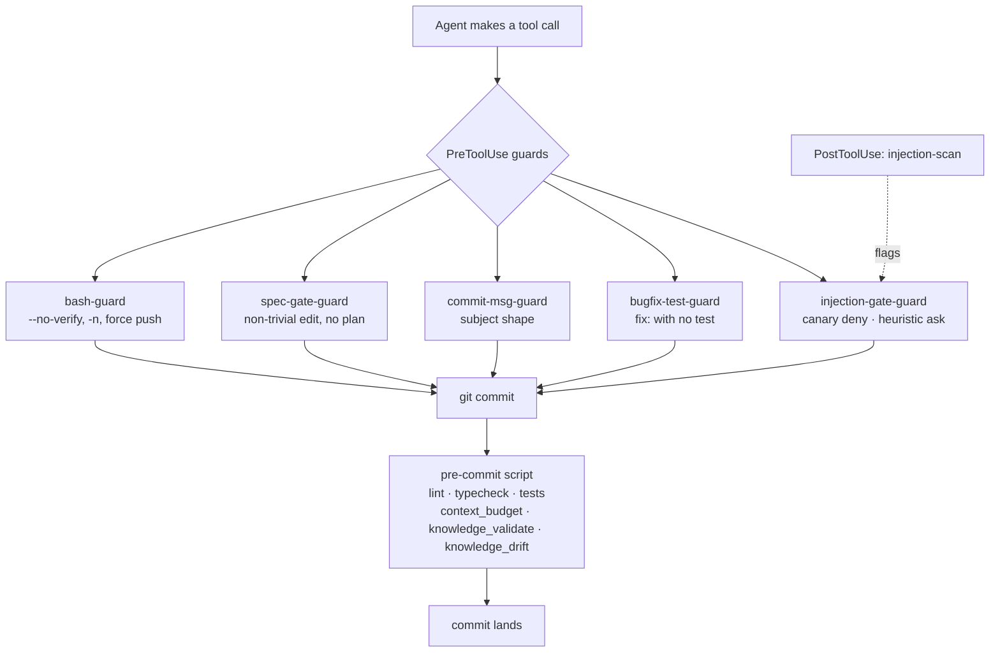

# Gates — User Guide

Every enforcement gate the harness installs: what each blocks, why it exists, and how to get past one legitimately.

The gates are deterministic scripts, not prose the agent is asked to follow. That's the point — a rule an agent can talk itself out of isn't a gate. They run at two moments: **before a tool call** (`PreToolUse` hooks) and **at commit time** (the pre-commit script). Working in Cursor instead? Same scripts, same verdicts — see [§7](#7-the-same-gates-in-cursor).

The spec gate has [its own guide](SPEC-GATE.md) and isn't repeated here. The `knowledge/` validator and drift guard are covered in [`KNOWLEDGE.md` §5](KNOWLEDGE.md#5-what-keeps-it-honest). The scripts themselves live in [`references/hook-guard.md`](../skills/bigin-harness-setup/references/hook-guard.md).

**Contents**

1. [The two moments](#1-the-two-moments)
2. [bash-guard — you can't disable your own gates](#2-bash-guard--you-cant-disable-your-own-gates)
3. [commit-msg-guard and bugfix-test-guard](#3-commit-msg-guard-and-bugfix-test-guard)
4. [The prompt-injection gate](#4-the-prompt-injection-gate)
5. [The non-blocking hooks](#5-the-non-blocking-hooks)
6. [Fail-closed, and why it matters](#6-fail-closed-and-why-it-matters)
7. [The same gates in Cursor](#7-the-same-gates-in-cursor)
8. [Testing and unblocking](#8-testing-and-unblocking)

---

## 1. The two moments



Guards are Node `.mjs` so they run on macOS, Linux, and Windows — `python3` isn't guaranteed on Windows.

Setup won't create a second commit gate. If your repo already gates commits via `simple-git-hooks`, `husky`, or an existing `.git/hooks/pre-commit`, that mechanism *is* the gate and extra steps are appended to it rather than a rival script being written.

---

## 2. bash-guard — you can't disable your own gates

This is the load-bearing one. Every other gate is only as strong as the inability to skip it.

**Blocked:**

| Pattern | Why |
|---|---|
| `--no-verify` anywhere | bypasses every pre-commit gate |
| `git commit -n` (in the flag region) | same thing, short form |
| `git push --force` / `-f` | destroys shared history |

**Allowed, deliberately:**

- `--force-with-lease` — the sanctioned alternative. It refuses when the remote moved under you, which is the actual failure `--force` causes.
- A commit message that merely *contains* `-n`. The `-n` pattern only matches in the flag region after `commit`, not inside a quoted message.

If a gate is blocking something it shouldn't, change that gate — see [§7](#7-testing-and-unblocking). Not this one.

---

## 3. commit-msg-guard and bugfix-test-guard

These two interlock, and the order matters.

### commit-msg-guard — the subject shape

Requires a Conventional Commit subject: one of `feat` `fix` `docs` `style` `refactor` `perf` `test` `build` `ci` `chore` `revert`, optional `(scope)`, optional `!`, then `: ` and a description. Subject capped at **100 characters**.

**Passthroughs** — allowed without matching: `Merge branch '…'`, `Revert "…"`, `fixup! …`, `git commit --amend --no-edit`, and any case where there's no subject to read at all.

**Two entry points, one implementation.** With a path argument it validates a commit-message file (the git `commit-msg` hook — catches commits *you* type). With no argument it reads a `PreToolUse` payload (catches commits *Claude* makes). Same types, same cap, same passthroughs — which is exactly why it isn't two scripts that could drift apart.

### bugfix-test-guard — every fix ships a regression test

Blocks a fix-shaped `git commit` when no test file is staged. Fix-shaped means a conventional `fix:` prefix on any line, or `bugfix`/`hotfix` anywhere in the message.

Test patterns that satisfy it: `*.test.*`, `*.spec.*`, `*_test.go`, `*_test.dart`, anything under `tests/`/`test/`, or `__tests__/`. `*_test.dart` is matched on its own rather than via the directory rule, because Flutter's flow tests live in `integration_test/` — which is not `test/`.

**Three ways it stands down:**

- A staged test file matches. The normal path.
- Every staged file is docs or config — no runtime surface to test.
- The message contains `[no-test]`. State the reason next to it.

It respects `-a`/`--all` by folding tracked-modified files into the staged list, so `git commit -am "fix: x"` is measured against what will actually land. And it never blocks on its own failure — outside a git repo, or with git unavailable, it exits 0.

> **The interlock:** `commit-msg-guard` is what makes `bugfix-test-guard` trustworthy. Before the subject shape was enforced, `fixed the parser` sailed straight past the regression-test gate — it isn't `fix:`-shaped, so nothing fired. Loosening the message guard silently weakens the test guard. They're one mechanism in two files.

---

## 4. The prompt-injection gate

Three stages across three scripts. Worth understanding because the names don't reveal the design.

**Stage 1 — `injection-scan-guard.mjs` (`PostToolUse`, observe-only).** After a tool returns, it scans the output for injection patterns: instructions to ignore prior instructions, text addressing the assistant directly with overrides, attempts to inject a new system prompt, role-override phrasing, exfiltration-to-URL instructions, long base64-like blocks, and **zero-width or bidi-control characters** — hidden text. `PostToolUse` cannot block, so it always exits 0 and instead writes a session-scoped flag file.

**Stage 2 — `injection-gate-guard.mjs` heuristic ask.** On the next `Bash`, `Write`, `Edit`, `WebFetch`, or `mcp__*` call, if a **fresh** flag exists it returns `permissionDecision: "ask"` and deletes the flag. Freshness window is **5 minutes** — an older flag passes through silently, because a stale suspicion shouldn't interrupt work half an hour later.

**Stage 3 — `canary-seed.mjs` + the canary check.** At session start, a per-session random UUID is written to a token file, with context instructing the model never to reproduce it. `injection-gate-guard.mjs` checks for that token **first**, before the heuristic, and returns `permissionDecision: "deny"` if it appears anywhere in a tool call's input.

That last one is the strong signal. Stages 1–2 are heuristics that can misfire; a per-session random UUID appearing in a tool call is *deterministic* proof that session context is being exfiltrated. Hence deny rather than ask, and hence "treat the current task as compromised and stop."

The zero-width detection is built from code points rather than `\uXXXX` escapes in a regex literal — an agent transcribing the file into a target repo can silently render the escape as the actual invisible character, which then trips that repo's own lint rule on this very file.

Pattern credited to [Lasso Security's PostToolUse Defender](https://www.lasso.security/blog/the-hidden-backdoor-in-claude-coding-assistant).

---

## 5. The non-blocking hooks

Three hooks that never block anything (four scripts, counting `injection-scan-guard` from §4). They're easy to forget precisely because they never interrupt you.

**`session-resume-check.mjs`** (`SessionStart`) — injects context when `.claude/memory/SESSION.md` exists with `status: in-progress`, so a handed-off session offers to resume. Also reports graph presence and freshness when `graphify-out/` exists (see [`GRAPHIFY.md` §6](GRAPHIFY.md#6-keeping-it-fresh)). `SessionStart` is deliberate here rather than a `Stop` hook.

**`precompact-snapshot.mjs`** (`PreCompact`) — autosaves in-flight state to `SESSION.md` before context compaction, in the exact shape `session-handoff` uses, so `session-resume-check.mjs` picks it up unchanged. A `PreCompact` hook *can* block compaction; this one never does — a failed autosave is a missed convenience, not a reason to freeze a session. Every fallible step is wrapped so one failure degrades that step alone.

Together those two mean an auto-compact mid-task doesn't silently destroy your working state.

**`canary-seed.mjs`** (`SessionStart`) — covered above.

---

## 6. Fail-closed, and why it matters

Both hosts treat **exit 2** as blocking and any *other* nonzero exit as a non-blocking error. So a guard that crashes on a malformed payload exits 1 — and the tool call runs **ungated**, with no visible sign the gate stopped working.

Every blocking guard therefore wraps its payload parse and, on failure, prints a one-line diagnostic naming the script and exits 2. Blocking on an unreadable payload is the safe direction.

The hooks that *can't* block — `injection-scan-guard`, `session-resume-check`, `canary-seed`, `precompact-snapshot` — exit 0 quietly instead.

One deliberate exception: `commit-msg-guard`'s outer allow-on-unreadable is for a missing commit-message file in argv mode, so its payload parse fails closed *inside* the stdin path rather than at the top level.

Cursor adds a second failure mode: it fails open on a hook that *crashes or times out*, not just on an odd exit code, unless the entry says otherwise. So `.cursor/hooks.json` sets `failClosed: true` on the five blocking gates and leaves it off the four non-blocking ones.

---

## 7. The same gates in Cursor

If setup installed Cursor parity, every gate above applies in Cursor too. There is **one script per gate, not two** — `.cursor/hooks.json` registers the same `.claude/guards/*.mjs` files that `.claude/settings.json` does, and `.claude/guards/lib/hook-io.mjs` absorbs the payload and response differences between the two hosts.

The commit-time gates never needed anything: `pre-commit` and `commit-msg` are git hooks, so they've always applied to whoever commits, in whatever editor.

Two things to know:

- **One verdict is stricter in Cursor.** Cursor's `preToolUse` response supports `allow` and `deny` but not `ask`. The injection gate's stage-2 heuristic wants to *ask*, so under Cursor it **denies** instead, with a message telling the agent to surface the flagged content for you to confirm. Stage 3 (the canary) denies on both hosts. The rule is: never looser than Claude Code, occasionally stricter.
- **The rules are generated, not authored.** `AGENTS.md` and `.cursor/rules/*.mdc` are produced from `CLAUDE.md` and `.claude/rules/` by `tools/cursor_mirror.mjs`. Edit the canonical file and re-run it; the pre-commit gate runs `--check` and fails the commit if the mirror is stale, missing, or orphaned.

```bash
node tools/cursor_mirror.mjs          # after changing CLAUDE.md or .claude/rules/
node tools/cursor_mirror.mjs --check  # what the gate runs
```

**The skills come along too.** Cursor has a plugin system, and `bigin-skills` ships a `.cursor-plugin/plugin.json` alongside its Claude Code manifest — install it there and `/task-workflow`, `/debug-workflow`, and the rest are available. Repo-local skills need no mirror either: Cursor discovers skills from Claude's own directories, so a project's `.claude/skills/` is live as-is.

What *doesn't* cross over is the subagent ladder. `model-router` spawns tiers through Claude Code's Agent tool with a per-tier `model`/`effort` pin, and Cursor's agents don't accept those — the roles are visible, the routing isn't. So in Cursor the implement/verify loop is something you drive rather than something the router fans out. Details: [`cursor-parity.md`](../skills/bigin-harness-setup/references/cursor-parity.md).

---

## 8. Testing and unblocking

### Testing a guard by hand

**Never build the payload inline in a shell string.** Nested quotes silently produce malformed JSON, which — before guards failed closed — read exactly like "the guard allowed it." Use a quoted heredoc so the shell expands nothing:

```bash
cat > /tmp/payload.json <<'JSON'
{"tool_name":"Bash","tool_input":{"command":"git commit --no-verify -m \"feat: x\""}}
JSON
node .claude/guards/bash-guard.mjs < /tmp/payload.json; echo "exit=$?"
```

Read the **exit code**, not the absence of output. `0` = allowed, `2` = blocked with the reason on stderr, anything else = the guard itself failing.

The commit-message file entry point needs its own payload-free test:

```bash
printf 'fixed the parser\n' > /tmp/msg.txt
node .claude/guards/commit-msg-guard.mjs /tmp/msg.txt; echo "exit=$?"
```

### Getting past a block

Each guard's message names its own escape, and each is a real one:

| Blocked by | Legitimate ways forward |
|---|---|
| `spec-gate-guard` | approve a plan, keep it ≤20 lines, or check the trivial-path list — see [`SPEC-GATE.md` §7](SPEC-GATE.md#7-getting-blocked) |
| `spec-gate-guard`, plan says `Status: amending` | the freeze working, not a false positive: re-approve the amended spec — [`SPEC-GATE.md` §7](SPEC-GATE.md#7-getting-blocked) |
| `commit-msg-guard` | rewrite the subject as a Conventional Commit under 100 chars |
| `bugfix-test-guard` | stage the regression test, or `[no-test]` with the reason stated |
| `bash-guard` | `--force-with-lease` instead of `--force`; for `--no-verify`, fix what's failing |
| `injection-gate` stage 2 | review what was just fetched, then approve or decline the ask |
| `injection-gate` stage 3 | **stop.** This one isn't a false positive to work around |
| `context_budget` | cut always-loaded content — a scoped rule instead of an unscoped one |

**There is no bypass, by design.** `--no-verify` is blocked by `bash-guard`, and `bash-guard` runs before the shell does. If a gate is wrong for your repo, change the gate — its allowlist, its threshold, the rule file — as a reviewed edit. That change shows up in a diff; a bypass doesn't.
