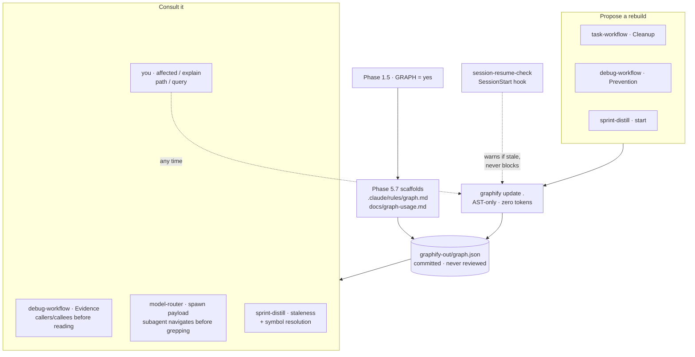

# graphify — User Guide

The optional structural-graph convention: what turning it on gives you, where it shows up in the daily workflow, and how it divides work with `knowledge/`.

`graphify` itself is third-party ([Graphify-Labs/graphify](https://github.com/Graphify-Labs/graphify)) — the plugin doesn't vendor it, and nothing in the harness requires it. But the harness *does* integrate it: `bigin-harness-setup` scaffolds the convention on opt-in, and four skills adapt their behavior when a graph exists.

This guide is the team-facing "why and when." The scaffolded **`docs/graph-usage.md` in your own repo is the operational reference** — install, query recipes, confidence tags, gitignore contract, large-graph caveats. Don't duplicate that content here; the two would drift.

**Contents**

1. [What it's for](#1-whats-its-for)
2. [Turning it on during harness setup](#2-turning-it-on-during-harness-setup)
3. [Role in each task-workflow step](#3-role-in-each-task-workflow-step)
4. [Role in the other skills](#4-role-in-the-other-skills)
5. [graphify vs. the knowledge bundle](#5-graphify-vs-the-knowledge-bundle)
6. [Keeping it fresh](#6-keeping-it-fresh)

---

## 1. What it's for

**Problem it solves:** finding what a change breaks costs a grep, four file reads, then two more greps — and most of those tokens go to *locating* code rather than understanding it.

graphify parses your code with tree-sitter into a graph of functions and files joined by `calls` / `imports` / `contains` / `inherits` edges, and answers **"where"** questions against it: what calls this, what breaks if I change it, how does this reach that.

**It costs zero tokens.** Local AST parsing — no LLM, no API key, nothing leaves the machine.

Three things it is not:

- **Not ground truth for behavior.** If a graph query and a source read disagree, the source read wins. `EXTRACTED` edges are reliable; `INFERRED` and `AMBIGUOUS` are pointers to a source read, never confirmation.
- **Not a source of code.** It cites `file:line`; you still read the file.
- **Not a substitute for `knowledge/`.** It holds structure, never intent. See §5.

An empty result is not evidence something doesn't exist — confirm with grep before concluding "not found."

---

## 2. Turning it on during harness setup

It's opt-in, decided as `GRAPH` in **Phase 1.5** of `bigin-harness-setup`. Say no and none of the scaffolding is written — no rule file, no gitignore entries, no version-pinned usage doc.

> **The decision controls scaffolding, not skill behavior.** Every integration keys off whether `graphify-out/graph.json` exists on disk, not off the Phase 1.5 answer. Drop a graph into a `GRAPH = no` repo and the wired steps below adopt it immediately — but without `.claude/rules/graph.md`, nothing reminds the agent that `INFERRED` edges aren't confirmation, that a source read wins a disagreement, or that the graph must be queried rather than read wholesale. Functional, unguarded. If you want the graph, take the scaffolding with it.

Say yes and **Phase 5.7** does four things:

1. Writes **`.claude/rules/graph.md`** — path-scoped, short. The load-bearing line: structural facts live only in the graph, never restated in `knowledge/` or a rule file.
2. Writes **`docs/graph-usage.md`** — your repo's operational reference, with the graphify version pinned at setup time.
3. **Prompts you to install.** This is the only place in the harness that does. The package is **`graphifyy`** — double `y`, and the typo is a typosquat lookalike, so don't guess it. Setup reads the tool's current README rather than hardcoding a command, because it releases often.
4. **Proposes** (never runs) the initial index: `graphify update .`.

### The gitignore contract

This one is counter-intuitive and worth stating plainly:

> **Commit `graphify-out/`.** Gitignore only `graphify-out/cost.json` and `graphify-out/cache/`.

The graph is checked in like any other generated-but-useful artifact, so a fresh clone has it immediately and skills can rely on it. Gitignoring the directory wholesale silently breaks every skill that checks for `graphify-out/graph.json`. Only two things are excluded: `cost.json` (bookkeeping that's meaningless without the run that produced it) and `cache/` (a local AST cache, not portable between machines).

Because it's tracked by design, `spec-gate-guard.mjs` exempts `graphify-out/**` from the plan gate — a large generated write there won't be blocked.

### Re-running setup

Phase 5.7 is idempotent. If `graphify-out/graph.json` already exists it proposes nothing, and existing templates aren't overwritten.

### How the pieces fit

Many skills *read* the graph; only a few propose *rebuilding* it, and none rebuild automatically.

**The left side is automatic; the right side never is.** Once `graph.json` exists, the four consumers adopt it with no action from you. Every rebuild, by contrast, is proposed and waits — `session-resume-check.mjs` warns, the three skills offer, you say yes.

Without a graph, every arrow into it degrades — see [§6](#6-keeping-it-fresh).

---

## 3. Role in each task-workflow step

Two of the six steps have graphify **wired in** — the skill changes behavior on its own. The rest are places it helps if you reach for it. The distinction matters: don't expect an unwired step to consult the graph unprompted.

| Step | Status | What the graph does |
|---|---|---|
| 1. Scope | manual | Confirm what the change actually touches before writing the one-sentence scope. |
| 2. Spec gate | manual | `model-router`'s capability scoring takes `--paths` from the files the request *implies*. A graph query makes that list derived rather than guessed, which moves the tier score off a hunch. |
| 3. Plan file | manual | The highest-value manual use. Blast radius per task — run it before writing the task table so the coverage check has something real to check against. |
| 4. Implement/verify | **wired** | `model-router` passes the spawned agent a note that the graph exists plus a `docs/graph-usage.md` pointer, so the implementer navigates structurally before grepping. |
| 5. Review | manual | Confirm nothing outside the intended blast radius moved. |
| 6. Cleanup | **wired** | If the task changed code and `graphify-out/graph.json` exists, a rebuild is **proposed** — `graphify update .`, AST-only, zero API cost. Proposed, never auto-run. |

Step 3 is where it pays most. A `PLAN.md` task table built from a real dependency walk survives the verify round better than one built from memory of the codebase, and the cost is one command.

Step 6's rebuild lands in the same commit as the code change — which is the point of committing `graphify-out/`.

---

## 4. Role in the other skills

- **`debug-workflow` — Evidence (step 2).** Wired. When the symptom names a function, handler, or table and the graph exists, it queries callers/callees/dependents *first* and reads only the files that implicates, instead of opening everything plausible. This is the single biggest token saving of the whole convention. Step 5 (Prevention) then proposes a rebuild if code changed.
- **`model-router`.** Wired, as above — graph presence travels in the spawn payload so subagents inherit it.
- **`sprint-distill`.** Wired, and the most interesting use. It checks whether commits since the graph's last build touched indexed paths and flags a stale graph before trusting anything downstream. In `KB_MODE = full` it resolves the identifiers each concept file names against the graph — a concept referencing a symbol that no longer exists is flagged stale with reason *"symbol no longer in graph."* That's expiry driven by code state rather than by calendar. Its B1 sweep also flags concept files whose content overlaps graph-extractable structure as deletion candidates, which is the enforcement arm of the §5 split.
- **`knowledge-distill`.** Treats structural facts as extracted, not distilled — it won't write them into a bundle.

---

## 5. graphify vs. the knowledge bundle

`.claude/rules/graph.md` states the rule in two lines; this is the reasoning behind it.

| | `knowledge/` | `graphify-out/` |
|---|---|---|
| Answers | What the system is, and **why** | **Where** the code is, and what connects |
| Content | Curated prose — decisions, invariants, contracts, library APIs | Derived symbols and edges |
| Produced by | Humans and `knowledge-distill`, deliberately | A parser, mechanically |
| Cost | LLM tokens, once per version, plus audit rounds | Zero tokens, continuously |
| Authority | Source of truth — reviewed in PR, validated at commit, drift-guarded | Never authoritative; a source read wins any disagreement |
| In git | Committed **and reviewed** | Committed, **never reviewed** — regenerated, not edited |
| Fails by | Lying about **intent** | Lying about **location** |

They fail differently, so they're protected differently. `knowledge/` is defended by review, `knowledge_validate.mjs`, and the drift guard — a human has to agree it's still true. The graph is defended by rebuilding, because a parser re-derives truth in seconds and a human can't.

**Never restate structural facts in `knowledge/`.** A concept file asserting "`AuthService` calls `TokenStore`" goes stale at the next refactor with nothing to catch it — and `sprint-distill`'s B1 sweep will flag it for deletion anyway. Link to the code instead.

**And the inverse: a graph doesn't replace a bundle.** It carries no rationale, no anti-patterns, no rejected alternatives. A repo with a perfect graph still can't say why the retry logic sits where it does.

### Library bundles specifically

`knowledge/libraries/<lib>/` is pinned to an exact version of *someone else's* code; the graph covers *yours*. On a task touching a library, the bundle gives the correct API at the version you're on, and the graph gives every place you already call it plus what depends on those call sites. Neither answers the other's question.

---

## 6. Keeping it fresh

A stale graph lies about location, so freshness matters — but the harness deliberately **never rebuilds automatically**. Three mechanisms, all non-blocking:

1. **`session-resume-check.mjs`** (a `SessionStart` hook) reports once per session whether the graph exists, its last-build commit, and — via a `git log` comparison against everything outside `graphify-out/` — whether anything has changed since. A warning, never a block.
2. **Proposed rebuilds at completion points**: `task-workflow` Cleanup, `debug-workflow` Prevention, `sprint-distill` start.
3. **Manual**: `graphify update .` any time. Incremental after the first run; a no-op takes well under a second.

**Don't run `graphify hook install`.** It writes post-commit *and* post-checkout hooks into `core.hooksPath` — which in a harness repo is the tracked `scripts/git-hooks/`, so they'd get committed and shipped to teammates who may not have the tool. The three mechanisms above already cover freshness at the moments it matters.

If the graph is missing entirely, every adopting skill falls back to grep and read **silently** — no error, no nagging. Deleting `graphify-out/` is a safe way to opt out mid-project.

> One gap worth knowing: `graphify affected "X"` — reverse traversal for blast radius, with `--depth` and `--relation` filters — is the most useful command for step 3 above, and the generated `docs/graph-usage.md` doesn't currently list it among its query recipes.
