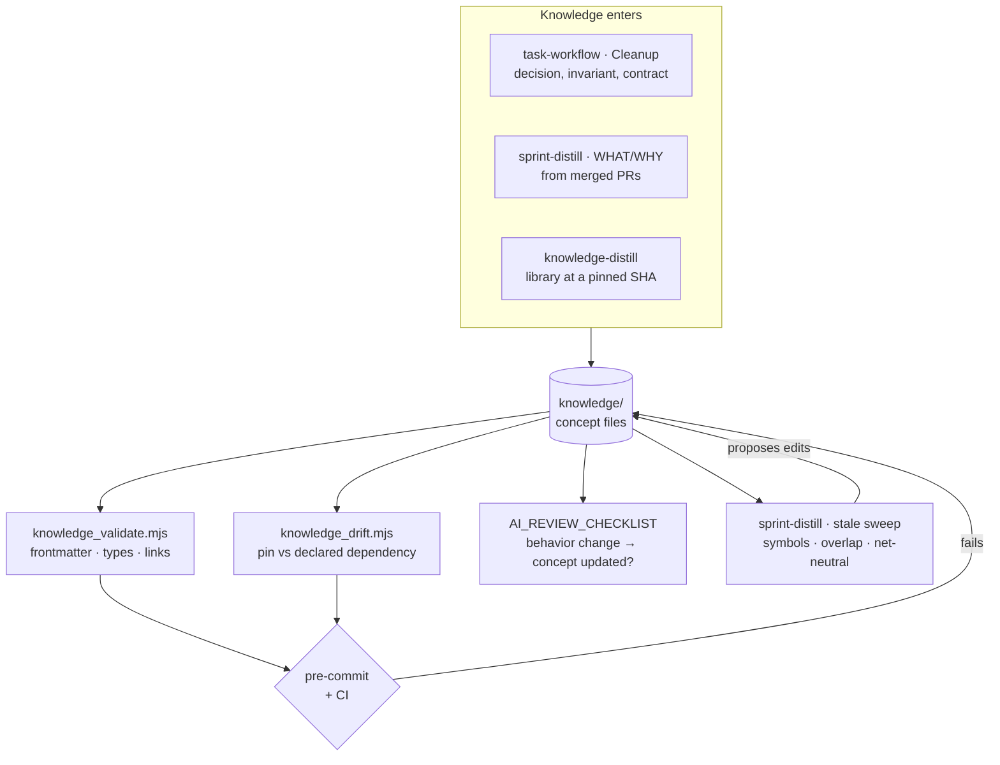

# Knowledge Bundle — User Guide

What `knowledge/` is for, how things get into it, and what keeps it from rotting.

The **authoritative format spec is the generated `knowledge/meta/knowledge-bundle-spec.md` in your own repo** — frontmatter schema, allowed `type` values, linking rules, validation. This guide doesn't restate it. What follows is the why and the when: what opting in scaffolds, which skills write into the bundle, where it shows up in the daily workflow, and how it expires.

For the structural graph it's often confused with, see [`GRAPHIFY.md`](GRAPHIFY.md). For the plugin itself, [`USER_GUIDE.md`](USER_GUIDE.md).

**Contents**

1. [What it's for](#1-whats-its-for)
2. [Turning it on during harness setup](#2-turning-it-on-during-harness-setup)
3. [Two kinds of knowledge](#3-two-kinds-of-knowledge)
4. [Role in each task-workflow step](#4-role-in-each-task-workflow-step)
5. [What keeps it honest](#5-what-keeps-it-honest)
6. [Where a fact belongs](#6-where-a-fact-belongs)

---

## 1. What it's for

**Problem it solves:** the reasoning behind a system lives in people's heads, in closed PRs, and in Slack. An agent starting fresh has none of it, so it re-derives — and re-derives differently each time.

`knowledge/` is a bundle of concept files holding **what the system is and why**: domain concepts, contracts, system boundaries, constraints that outlive a sprint. One concept per file. Agents reach it through an **index-first read protocol** — read `knowledge/index.md`, where one-line summaries are sufficient for routine work, and open a concept file only when a summary isn't enough.

That protocol is the whole cost model. The bundle can grow for years without growing what a session loads, because the default read is the index, not the contents.

Three things it is not:

- **Not how-we-work.** Conventions, gates, and process live in `.claude/rules/` and the plugin. `knowledge/` answers what and why; rules answer how. Don't mix them.
- **Not a place for structural facts.** Call flow, dependency, schema shape belong in the graph — they're extracted, not written. See §6.
- **Not documentation.** Concept files **point at sources of truth** — `openapi.yaml`, `.claude/rules/`, the source itself — and never duplicate them. If you're about to paste a schema in, link to it instead.

Every `.md` under `knowledge/` is a concept file with valid frontmatter. There are no freeform docs in there — that's what makes the validator able to check the whole tree.

---

## 2. Turning it on during harness setup

Opt-in, decided as `KNOWLEDGE_BUNDLE` in **Phase 1.5** of `bigin-harness-setup`. **Phase 5.5** then does six things — note that only the first three are the bundle, and the last three are what stop it rotting:

1. **`.claude/rules/knowledge.md`** — unscoped, so it's always loaded. It's short on purpose: it carries the what/why-vs-how split and the index-first protocol, and nothing else.
2. **The starter bundle** — `index.md`, `meta/knowledge-bundle-spec.md` (the canonical spec), `contracts/openapi-contract.md`, `constraints/agent-rules.md`, and `log.md`.
3. **`tools/knowledge_validate.mjs`** — zero-dependency Node, no install step.
4. **Pre-commit wiring** — the validator is appended to `scripts/pre-commit.sh`, or to your existing `simple-git-hooks`/`husky` config rather than creating a second script.
5. **CI wiring** — automatic if Phase 5.6 generates CI in the same run. If you already have *foreign* CI, setup won't edit it and instead tells you in the Phase 7 summary to add the validator step yourself.
6. **Review wiring** — one line into `AI_REVIEW_CHECKLIST.md`: *"Behavior-changing PR → related knowledge/ concept updated?"*

Library bundles are **suggested, never scaffolded.** Setup names the dependencies an agent is most likely to get wrong and points at `/knowledge-distill`. It writes no files and creates no `libraries/` directory — a bundle costs a clone, a topic decision, and an audit pass, so it belongs in its own invocation.

> Steps 1–3 are the canonical install list. `knowledge-distill`'s Phase 0a reuses them verbatim to bootstrap a repo with no bundle, deliberately without restating the file list. If you change the starter files here, also update the index template that links them — a dropped file becomes a broken link and a validator error.

Decline `KNOWLEDGE_BUNDLE` and nothing else in the harness cares. Unlike the graph, no skill probes for a `knowledge/` directory and adapts — `task-workflow`'s cleanup step skips its distill prompt when the bundle is absent, and that's the extent of it.

---

## 3. Two kinds of knowledge

The bundle holds two populations with different authors, lifecycles, and failure modes.

| | Our own system | A third-party library |
|---|---|---|
| Lives in | `knowledge/<folder>/` | `knowledge/libraries/<lib>/` |
| Written by | `sprint-distill`, `task-workflow` cleanup, humans | `/knowledge-distill` |
| Sourced from | Merged PRs, decisions, incidents | The library's own repo at a pinned commit |
| Pinned to | Nothing — it tracks your code | An exact tag *and* the resolved SHA |
| Verified by | Human review in PR | A `knowledge-auditor` subagent, against the clone |
| Expires when | Behavior changes | The dependency moves a minor |

**Library bundles are not a separate format.** They're ordinary concept files under `knowledge/libraries/<lib>/`, subject to the same validator. What's specific to them: flat provenance frontmatter (`library`, `version`, `source_repo`, `source_commit`, `docs_path`), a `# Citations` section in every file, and tighter budgets.

Three rules of `knowledge-distill` worth knowing before you invoke it:

- **It refuses "latest."** A bundle whose version came from whatever `HEAD` happened to be looks pinned and isn't, and can be neither audited nor drift-checked. It will ask.
- **It rewrites, never copies.** These are our distillations, not a mirror of someone's docs. Short code shapes are fine; a copied chapter is not.
- **A bundle that hasn't passed a clean audit is not committed.** A fresh `knowledge-auditor` checks the files against the *cloned source*, never against the distiller's account of what it wrote — the same independence principle as `task-workflow`'s verifier. Capped at three rounds.

Team conventions get **blended visibly**: a relevant `.claude/rules/*` rule is folded in at the point of relevance, prefixed `Team convention:`, and the paths are listed in `conventions_blended`. Never silently merged into a library fact.

---

## 4. Role in each task-workflow step

`knowledge/` is wired more deeply than the graph — it has an always-loaded rule, a cleanup prompt, a commit gate, and a review line.

| Step | Status | What the bundle does |
|---|---|---|
| 1. Scope | **wired** | `.claude/rules/knowledge.md` is always loaded, so the index-first protocol applies from the first turn: read `knowledge/index.md` before non-trivial changes. |
| 2. Spec gate | manual | The index tells you which contracts and constraints the spec has to respect. A library bundle gives the correct API at your pinned version. |
| 3. Plan file | manual | Nothing automatic. Worth a look when a task touches a documented contract. |
| 4. Implement/verify | manual | The implementer inherits the always-loaded rule, so the protocol travels — but no skill pushes specific concept files into the payload. |
| 5. Review | **wired** | `AI_REVIEW_CHECKLIST.md` carries the behavior-change line, so review asks whether the concept file was updated. |
| 6. Cleanup | **wired** | Before `PLAN.md` is deleted, if the task established or changed a **decision, invariant, contract, or constraint** — not merely "added a feature" — the specific edit is proposed: which file, what line. |
| commit | **wired** | `knowledge_validate.mjs` and `knowledge_drift.mjs` run in pre-commit and CI. |

Step 6 is the one to understand. `PLAN.md` is the only written record of *why* a task took its shape, and deleting it is the last chance to keep any of that. The prompt is deliberately narrow: **nothing durable is the common case** for routine work, and the skill says so rather than inventing a concept to justify the step. Concepts are per-invariant, not per-task — amending an existing file beats adding one, and any new file needs a summary line in `knowledge/index.md` or the validator flags it unreachable.

---

## 5. What keeps it honest

A knowledge bundle's failure mode is confident staleness: prose that reads authoritative and describes a system that changed. Four mechanisms, each catching a different kind of rot.

**`knowledge_validate.mjs`** — catches *structural* rot. Every file has valid frontmatter and an allowed `type`; every bundle-relative link resolves; `timestamp` is valid ISO 8601 when present. Missing `description`/`tags` and index-unreachable files are warnings, not failures. Runs in pre-commit and CI.

**`knowledge_drift.mjs`** — catches *version* rot in library bundles. It compares each bundle's `version` against the version **declared** in `package.json` or `go.mod` and fails on a minor-or-above divergence. Declared, not locked — reading four lockfile formats would need a YAML parser and a dependency for a signal the declared range already gives, and a patch move doesn't change an API surface.

> **The escape hatch:** set `drift_ack: <declared-version>` in the bundle's index frontmatter to accept a known divergence. It suppresses the failure for that exact declared version and nothing else — bump again and the guard fires again. It lives in the file being acknowledged, shows up in the diff, and a re-distill deletes it. Without it the only way past is `--no-verify`, which `bash-guard.mjs` blocks outright.

**Review** — catches *behavior* rot. The staleness policy is that any PR meaningfully changing behavior updates the related concept file **in the same PR**, and the checklist line is what makes someone check.

**`sprint-distill`** — catches everything the other three miss, once per sprint. It flags concepts whose referenced identifiers no longer resolve in the graph (*"symbol no longer in graph"* — expiry by code state, not calendar), flags concept files that overlap graph-extractable structure as deletion candidates, and enforces a **net-neutral** rule: every addition names what it replaces or cites budget headroom. It compresses, never appends. Then it **stops** and shows you every proposed change before writing anything.

`knowledge/log.md` gets one entry per sprint. Concept files not linked from `index.md` are stale by definition.

---

## 6. Where a fact belongs

Four surfaces, one question each. Putting a fact in the wrong one is the most common way this convention goes wrong, because the wrong home has no mechanism to expire it.

| Surface | Question | Lifetime |
|---|---|---|
| `knowledge/` | What is the system, and why? | Outlives sprints; expires on behavior change |
| `.claude/rules/` | How do we work here? | Outlives projects; changes by decision |
| `graphify-out/` | Where is the code, and what connects? | Regenerated; expires every commit |
| `PLAN.md` | What are we doing right now? | Deleted at task end |

Three mistakes worth naming:

**Structural facts in `knowledge/`.** "`AuthService` calls `TokenStore`" is true until the next refactor, and nothing in the bundle will catch it — that's what the graph is for, and `sprint-distill`'s sweep flags such files for deletion. Link to the code instead.

**Conventions in `knowledge/`.** "We use conventional commits" is how-we-work. It belongs in `.claude/rules/` or the plugin, where `sprint-distill`'s net-neutral budget applies to it.

**Per-task narrative in `knowledge/`.** "Added the export button" is not an invariant. Step 6's prompt exists to catch decisions, not to log features — and answering "nothing durable here" is the correct outcome most of the time.

The inverse also holds: a graph, a rule file, and a `PLAN.md` together still can't say *why* the retry logic sits where it does. That sentence only has one home.
