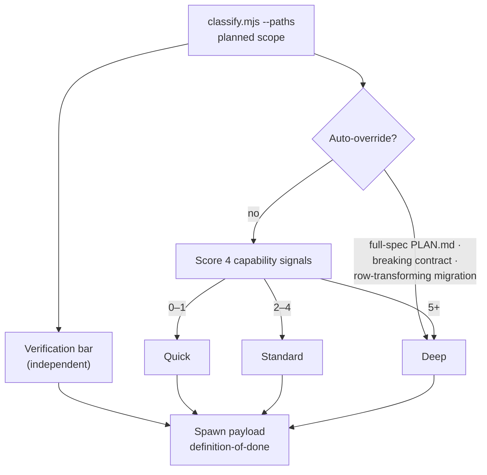

# Model Routing — User Guide

Which model runs your task, how carefully it gets checked, and what you can actually change.

`model-router` decides two things that look like one: **which tier executes** and **how hard it gets verified**. They're scored on separate axes, and conflating them is the most common way this gets misread.

The canonical references are [`references/model-profiles.md`](../skills/model-router/references/model-profiles.md) (ladders, config schema, the effort rationale in full) and [`references/scoring-rubric.md`](../skills/model-router/references/scoring-rubric.md) (the scoring tables plus five worked examples). This guide covers what to do with them.

**Contents**

1. [Two axes, not one](#1-two-axes-not-one)
2. [The three ladders](#2-the-three-ladders)
3. [How a tier gets chosen](#3-how-a-tier-gets-chosen)
4. [The verification bar](#4-the-verification-bar)
5. [Effort, and why you can't set it](#5-effort-and-why-you-cant-set-it)
6. [Configuring it](#6-configuring-it)
7. [Gotchas](#7-gotchas)

---

## 1. Two axes, not one

**Model choice answers "could it do this at all."** **Effort answers "did it check its work."**

Those are different questions with different inputs, so they're scored separately:

- **Capability** → picks the tier (`quick` / `standard` / `deep`). Inputs: is there a pattern to follow, is there a structural judgment call, is the problem understood, how many files at once.
- **Verification** → sets the bar (what the payload demands). Inputs: high-risk paths, coverage, new files, breadth, flaky symptoms.

A change can be mechanically trivial and still need heavy checking — a one-line edit to a contract or a migration. Scoring them together would either overpay for the model or underpay for the checking. Notably, **reversibility and blast radius are deliberately not capability signals**; they belong to the verification axis.



The bar never changes which model runs. It changes what the spawned agent is required to deliver.

---

## 2. The three ladders

A profile sets both the model and the effort of every tier.

| Profile | quick | standard | deep | verifier |
|---|---|---|---|---|
| `opus-centric` (default) | `sonnet`/low | `opus`/medium | `opus`/high | `sonnet`/high |
| `frontier` | `sonnet`/low | `opus`/high | `fable`/high | `sonnet`/high |
| `lean` | `sonnet`/low | `sonnet`/high | `opus`/high | `sonnet`/medium |

**`opus-centric`** — the cost-aware default. Its standard tier runs `opus` at `medium` and leans on the verifier round for the checking. Under this ladder the deep tier's entire escalation over standard is **effort**, not model — both run `opus`. That's the design: work reaching deep is diagnosed as "didn't check its work," which is the effort axis.

**`frontier`** — everything above quick at full effort, deep on the top model. Opt in when architectural calls are frequent, or when standard-tier work at `medium` returns verifier `FAIL`s often enough that paying up front beats paying per loop round.

**`lean`** — cost-first, trading the other way: a cheaper model at fuller effort. Standard drops `opus`→`sonnet` but keeps `high`, buying back with thoroughness what it gives up in capability.

### The agent is not the tier name

Effort can't be passed at spawn time — it comes only from the spawned agent's frontmatter. So a profile that wants a tier at a non-default effort routes to a **variant agent**:

| Tier | `opus-centric` | `frontier` | `lean` |
|---|---|---|---|
| Quick | `quick-executor` | `quick-executor` | `quick-executor` |
| Standard | `standard-worker` | **`standard-worker-high`** | **`standard-worker-high`** |
| Deep | `deep-architect` | `deep-architect` | `deep-architect` |
| Verifier | `verifier` | `verifier` | **`verifier-medium`** |

The router spawns `routing.agents[tier]` verbatim rather than deriving a name from the tier. Deriving it would silently run the task at the wrong effort — which is invisible in the output.

---

## 3. How a tier gets chosen

**Auto-overrides first.** Three conditions skip scoring entirely and go straight to Deep:

- a full-spec `PLAN.md` already exists (`fullSpecDetected` — an explicit user signal)
- a **breaking** contract change
- a data migration that **transforms existing rows**

A high-risk path match is **not** an override. Additive contract changes and version bumps touch the same paths and are ordinary work. What high-risk paths do change is the verification bar.

**Otherwise, four signals, scored:**

| Signal | 0 | +1 | +2 | +3 |
|---|---|---|---|---|
| Pattern to follow | equivalent exists here | similar, needs adaptation | | none — new pattern |
| Structural judgment | one obvious structure | | >1 reasonable, choice matters | |
| Problem understood | requirements + cause clear | some ambiguity | unfamiliar domain / unknown cause | |
| Simultaneous context | ≤2 files | 3–9 files | 10+ files | |

**0–1 → Quick · 2–4 → Standard · 5+ → Deep.**

You're asked to confirm only when the score sits exactly on a bucket boundary *and* the signals were ambiguous. Separately, `task-workflow` pauses before spawning `deep-architect` regardless — it's the most expensive tier and the biggest behavior swing. Standard and quick spawn without asking.

**Signals come from planned scope, not the working tree.** Routing happens before work starts, so `classify.mjs` is called with `--paths` naming the files you're *about* to change. Without it, it falls back to uncommitted changes and then the branch diff — correct mid-task, wrong at the start.

---

## 4. The verification bar

Set from the mechanical signals, independent of tier. **Triggers stack.**

| Trigger | Bar |
|---|---|
| high-risk path matched | verifier round **mandatory** even where `task-workflow` would skip it; full gate output; revert path in `PLAN.md` |
| coverage < 0.3, or null with code changes | tests first, TDD ordering |
| planned new files | tests first — a new module has no coverage by construction, not neglect |
| 5+ files | gates across the whole tree, not just touched files |
| flaky/timing symptom | ≥5 consecutive passes |
| none of the above | normal gates: lint + typecheck + tests, output shown |

The bar travels in the spawn payload's **`definition-of-done`**, so an unmet bar is a concrete gap at return-evaluation rather than a footnote someone can wave through.

One interaction worth knowing: `task-workflow` will spawn `standard` instead of `quick` whenever *any* bar trigger fired, even on a capability score of 0–1. A task adding a new file therefore rarely runs at the quick tier — writing a fresh test suite is the part that doesn't belong at `low` effort.

---

## 5. Effort, and why you can't set it

**`high` is the documented default** on every model that supports effort (only Opus 4.7 defaults to `xhigh`). The guidance is to use the default unless a failure diagnoses otherwise — a wrong answer despite full context means reach for a better **model**; a skipped file or unrun tests means raise **effort**. So every pin away from `high` has to earn it.

Two pins are deliberately below default, and only under `opus-centric`:

- **Quick at `low`** — short, scoped, latency-sensitive work that isn't intelligence-sensitive. High effort on a mechanical single-file edit produces slow, hedged output; routing down is the point of the tier.
- **Standard at `medium`** — the volume tier. Work reaching it has an established pattern and an approved `PLAN.md` already naming the files and edge cases, so most of what default effort buys is re-deriving decisions the plan already made. The failure it risks — a skipped file, an unrun test — is exactly what the verifier round catches, and only on the tasks that actually miss.

> **`high` is the ceiling. No tier pins to `xhigh` or `max`, on any profile, ever.** Not for deep, not for a new agent, not "just this once." The checking a higher pin would buy is already supplied structurally by the implement/verify loop, which re-reads the diff against `PLAN.md` with a fresh agent. Buying it twice produces hedged, slow output on work that didn't need it. **If deep-tier work comes back wrong, the fix is upstream — an under-specified `PLAN.md` or a missing convention in `.claude/rules/` — not a higher pin.**

The verifier sits at `high` on purpose. Its output is one JSON object, but the analysis is hard: it must catch **omissions**, which is harder than judging what's present. And the error is asymmetric — a false `FAIL` costs one loop round, a false `PASS` silently voids the guarantee the whole loop exists for.

That asymmetry is why `lean`'s `verifier-medium` is a knowing bet, not an oversight: the verifier runs on every round of every task and is that profile's largest line item. If a project depends on the loop's guarantee, it's the first thing to buy back.

---

## 6. Configuring it

`.claude/model-routing.json`, written by `bigin-harness-setup` from its Phase 1.5 `MODEL_ROUTING` decision. Both keys optional.

```json
{
  "profile": "opus-centric",
  "models": { "deep": "fable" }
}
```

Valid profiles: `opus-centric` · `frontier` · `lean`. Tier keys: `quick` · `standard` · `deep` · `verifier`. Models: `fable` · `opus` · `sonnet` · `haiku`.

**There is no `effort` key.** Effort can only come from the spawned agent's frontmatter, so setting one produces a warning and is otherwise ignored. Pick the profile whose effort ladder you want instead.

Buying back `lean`'s verifier — model only, since the `medium` pin isn't settable here:

```json
{ "profile": "lean", "models": { "verifier": "opus" } }
```

**Precedence:**

1. **On-demand instruction this request** — "run this one on fable", "use lean here". That spawn only; the project config isn't edited for a one-off.
2. **`.claude/model-routing.json`** — the project's standing choice.
3. **`opus-centric`** default when there's no file.

An on-demand instruction names a **model**, not an effort: *"run this on fable at max effort"* isn't satisfiable at spawn time, and you should be told so rather than have the effort part silently dropped. Asking for a *ladder* does move effort, since that changes which agent is spawned.

**Malformed config never blocks a routing decision** — bad JSON, unknown profile, unknown tier, or unknown model all degrade to the default and land in `warnings`, which get relayed to you. A config you think is active but isn't is worse than no config.

---

## 7. Gotchas

**`scope: none` means unknown, not zero.** On a clean tree with no `--paths`, the mechanical signals come back `null`. Scoring a `null` as 0 points is what once made every fresh task look trivial. The fix is re-running with `--paths` or estimating from the stated scope — never treating absence as a low score.

**A scope that's entirely new files reports `testCoverageRatio: null`, not `0`.** Files that don't exist yet are excluded from the ratio and reported separately as `plannedNewFiles`. A file with no code in it can't be "untested," and folding it in produced a 0 that read as risk when it only meant "new." The new-file case still raises the bar — via its own trigger, not a fake coverage number.

**Exhaustion never escalates to Deep.** If the return-evaluation loop hits its cap (2 follow-up cycles, 3 dispatches total), quick-tier exhaustion buys exactly one `standard-worker` attempt with the full loop history folded in. Standard and deep exhaustion surface to you. Deep is reachable through the capability score or its auto-overrides — never by failing your way up.

**`ROUTING_MISMATCH:` short-circuits.** If a spawned agent reports the tier was wrong, that jumps straight to re-scoring rather than continuing the retry loop — a wrong tier makes definition-of-done checks meaningless. Model and effort are fixed once an agent is spawned; the answer is a new spawn, never mutating the running one.

**Haiku accepts no effort level.** No profile routes to it, but it remains a valid override — and any tier overridden to `haiku` runs with its frontmatter effort pin inert. Overriding the verifier to `haiku` gives up effort control on the one agent whose failures are invisible.

**The routing line is worth reading.** You'll see something like *"Standard tier → `standard-worker-high` on sonnet/high (lean ladder), bar: tests first"* — that names what you're actually paying for. "Standard tier" alone doesn't.
