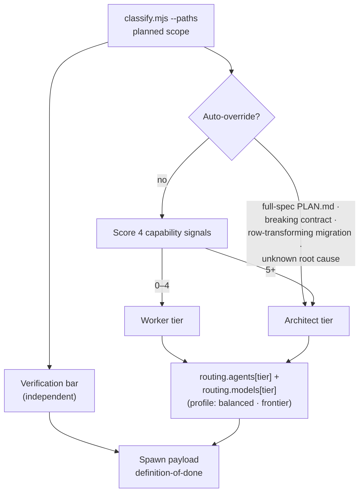
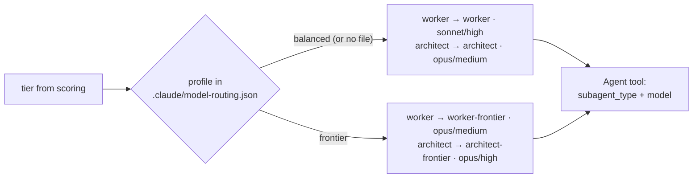

# Model Routing — User Guide

Which model runs your task, how carefully it gets checked, and what you can actually change.

`model-router` decides two things that look like one: **which tier executes** and **how hard it gets verified**. They're scored on separate axes, and conflating them is the most common way this gets misread.

The canonical references are [`references/model-profiles.md`](../skills/model-router/references/model-profiles.md) (ladders, config schema, the effort rationale in full) and [`references/scoring-rubric.md`](../skills/model-router/references/scoring-rubric.md) (the scoring tables plus five worked examples). This guide covers what to do with them.

**Contents**

1. [Two axes, not one](#1-two-axes-not-one)
2. [The two ladders](#2-the-two-ladders)
3. [How a tier gets chosen](#3-how-a-tier-gets-chosen)
4. [The verification bar](#4-the-verification-bar)
5. [Effort, and why you can't set it](#5-effort-and-why-you-cant-set-it)
6. [Configuring it](#6-configuring-it)
7. [Gotchas](#7-gotchas)

---

## 1. Two axes, not one

**Model choice answers "could it do this at all."** **Effort answers "did it check its work."**

Those are different questions with different inputs, so they're scored separately:

- **Capability** → picks the tier (`worker` / `architect`). Inputs: is there a pattern to follow, is there a structural judgment call, is the problem understood, how many files at once.
- **Verification** → sets the bar (what the payload demands). Inputs: high-risk paths, coverage, new files, breadth, flaky symptoms.

A change can be mechanically trivial and still need heavy checking — a one-line edit to a contract or a migration. Scoring them together would either overpay for the model or underpay for the checking. Notably, **reversibility and blast radius are deliberately not capability signals**; they belong to the verification axis.


```mermaid
flowchart TD
    A["classify.mjs --paths<br/>planned scope"] --> B{"Auto-override?"}
    B -->|"full-spec PLAN.md ·<br/>breaking contract ·<br/>row-transforming migration ·<br/>unknown root cause"| AR["Architect tier"]
    B -->|no| C["Score 4 capability signals"]
    C -->|"0–4"| W["Worker tier"]
    C -->|"5+"| AR

    W --> R["routing.agents[tier] +<br/>routing.models[tier]<br/>(profile: balanced · frontier)"]
    AR --> R

    A --> V["Verification bar<br/>(independent)"]
    V --> P["Spawn payload<br/>definition-of-done"]
    R --> P
```

The bar never changes which tier or model runs. It changes what the spawned agent is required to deliver.

---

## 2. The two ladders

A profile sets both the model and the effort of every tier.

| Profile | worker | architect | verifier |
|---|---|---|---|
| `balanced` (default) | `sonnet`/high | `opus`/medium | `sonnet`/high |
| `frontier` | `opus`/medium | `opus`/high | `sonnet`/high |

**`balanced`** — the cost-aware default. The worker tier, which takes everything from a copy fix to a multi-file feature on an established pattern, runs on Sonnet 5.5 at full effort: half Opus's per-token price, with effort buying the thoroughness that pattern-following work mostly needs. Opus is spent only on architect-tier work, at `medium` — its own default.

**`frontier`** — capability first. Worker-tier work moves to Opus at its default effort, and the architect tier gets one step more (`high`). Opt in when worker-tier misses are "it tried and got it wrong" rather than "it skipped a step", or when architectural calls are frequent and expensive to get wrong.

Fable is on neither ladder. It is reachable as a per-tier override (`"models": { "architect": "fable" }`), at two and a half times Opus's price.

### The agent is not the tier name

Effort can't be passed at spawn time — it comes only from the spawned agent's frontmatter. So a profile that wants a tier at a different effort routes to a **variant agent**:

| Tier | `balanced` | `frontier` |
|---|---|---|
| Worker | `worker` | **`worker-frontier`** |
| Architect | `architect` | **`architect-frontier`** |
| Verifier | `verifier` | `verifier` |

A `-frontier` agent has the same body as its base; only its name, model, effort and description differ, and the pre-commit gate keeps it that way. The router spawns `routing.agents[tier]` verbatim rather than deriving a name from the tier. Deriving it would silently run the task at the wrong effort — which is invisible in the output.


```mermaid
flowchart LR
    T["tier from scoring"] --> K{"profile in<br/>.claude/model-routing.json"}
    K -->|"balanced (or no file)"| B1["worker → worker · sonnet/high<br/>architect → architect · opus/medium"]
    K -->|frontier| F1["worker → worker-frontier · opus/medium<br/>architect → architect-frontier · opus/high"]
    B1 --> S["Agent tool:<br/>subagent_type + model"]
    F1 --> S
```

---

## 3. How a tier gets chosen

**Auto-overrides first.** Four conditions skip scoring entirely and go straight to the architect tier:

- a full-spec `PLAN.md` already exists (`fullSpecDetected` — an explicit user signal)
- a **breaking** contract change
- a data migration that **transforms existing rows**
- a bug whose **root cause is unknown**, however small the scope: with the worker tier on Sonnet, a confident wrong fix costs more than an architect run

A high-risk path match is **not** an override. Additive contract changes and version bumps touch the same paths and are ordinary work. What high-risk paths do change is the verification bar.

**Otherwise, four signals, scored:**

| Signal | 0 | +1 | +2 | +3 |
|---|---|---|---|---|
| Pattern to follow | equivalent exists here | similar, needs adaptation | | none — new pattern |
| Structural judgment | one obvious structure | | >1 reasonable, choice matters | |
| Problem understood | requirements + cause clear | some ambiguity | unfamiliar domain / unknown cause | |
| Simultaneous context | ≤2 files | 3–9 files | 10+ files | |

**0–4 → Worker · 5+ → Architect.**

You're asked to confirm only when the score sits exactly on a bucket boundary *and* the signals were ambiguous. Separately, `task-workflow` pauses before spawning the architect tier regardless — it's the most expensive tier and the biggest behavior swing. The worker tier spawns without asking.

**Signals come from planned scope, not the working tree.** Routing happens before work starts, so `classify.mjs` is called with `--paths` naming the files you're *about* to change. Without it, it falls back to uncommitted changes and then the branch diff — correct mid-task, wrong at the start.

---

## 4. The verification bar

Set from the mechanical signals, independent of tier. **Triggers stack**, and none of them changes the tier.

| Trigger | Bar |
|---|---|
| high-risk path matched | verifier round **mandatory** even where `task-workflow` would skip it; full gate output; revert path in `PLAN.md` |
| coverage < 0.3, or null with code changes | tests first, TDD ordering |
| planned new code files | tests first — a new module has no coverage by construction, not neglect. New docs and config files never count |
| 5+ files | gates across the whole tree, not just touched files |
| flaky/timing symptom | ≥5 consecutive passes |
| none of the above | normal gates: lint + typecheck + tests on the touched scope, each run's pass/fail summary line shown (never whole logs) |

The bar travels in the spawn payload's **`definition-of-done`**, so an unmet bar is a concrete gap at return-evaluation rather than a footnote someone can wave through.

---

## 5. Effort, and why you can't set it

The guidance is to stay at a model's default effort unless a failure diagnoses otherwise — a wrong answer despite full context means reach for a better **model**; a skipped file or unrun tests means raise **effort**. Defaults differ per model: Opus 5.5's is `medium`, so the `balanced` architect sits exactly at it. Every pin is argued against its own model's default in [`model-profiles.md`](../skills/model-router/references/model-profiles.md).

- **Worker at `high` on Sonnet (`balanced`)** — the cheaper model at full effort. Worker-tier failures are mostly "didn't check its work", which is the effort axis; the verifier round catches what still slips, on the tasks that actually miss.
- **Worker at `medium` on Opus (`frontier`)** — the other trade: the stronger model at its default, for projects whose misses effort doesn't fix.
- **Architect at `high` (`frontier`)** — one step above Opus's default, at the ceiling.

> **`high` is the ceiling. No tier pins to `xhigh` or `max`, on any profile, ever.** Not for the architect tier, not for a new agent, not "just this once." The checking a higher pin would buy is already supplied structurally by the implement/verify loop, which re-reads the diff against `PLAN.md` with a fresh agent. Buying it twice produces hedged, slow output on work that didn't need it. **If architect-tier work comes back wrong, the fix is upstream — an under-specified `PLAN.md` or a missing convention in `.claude/rules/` — not a higher pin.**

The verifier sits at `sonnet`/high on both profiles, on purpose. Its output is one JSON object, but the analysis is hard: it must catch **omissions**, which is harder than judging what's present. And the error is asymmetric — a false `FAIL` costs one loop round, a false `PASS` silently voids the guarantee the whole loop exists for. No profile economises on the one agent whose failures nobody sees.

---

## 6. Configuring it

`.claude/model-routing.json`, written by `bigin-harness-setup` from its Phase 1.5 `MODEL_ROUTING` decision. Both keys optional.

```json
{
  "profile": "balanced",
  "models": { "architect": "fable" }
}
```

Valid profiles: `balanced` · `frontier`. Tier keys: `worker` · `architect` · `verifier`. Models: `fable` · `opus` · `sonnet` · `haiku`.

**There is no `effort` key** — for the reason in [§2](#2-the-two-ladders). Setting one produces a warning and is otherwise ignored; pick the profile whose effort ladder you want instead.

Raising the verifier above `sonnet` — model only, since effort isn't settable here (and at `high` already, there is nothing left to set):

```json
{ "profile": "balanced", "models": { "verifier": "opus" } }
```

**Precedence:**

1. **On-demand instruction this request** — "run this one on fable", "use frontier here". That spawn only; the project config isn't edited for a one-off.
2. **`.claude/model-routing.json`** — the project's standing choice.
3. **`balanced`** default when there's no file.

An on-demand instruction names a **model**, not an effort: *"run this on fable at max effort"* isn't satisfiable at spawn time, and you should be told so rather than have the effort part silently dropped. Asking for a *ladder* does move effort, since that changes which agent is spawned.

**Malformed config never blocks a routing decision** — bad JSON, unknown profile, unknown tier, or unknown model all degrade to the default and land in `warnings`, which get relayed to you. The retired three-tier names (`opus-centric`, `lean`, `quick`/`standard`/`deep`) are unknown values now, not aliases. A config you think is active but isn't is worse than no config.

---

## 7. Gotchas

**`scope: none` means unknown, not zero.** On a clean tree with no `--paths`, the mechanical signals come back `null`. Scoring a `null` as 0 points is what once made every fresh task look trivial. The fix is re-running with `--paths` or estimating from the stated scope — never treating absence as a low score.

**A scope that's entirely new files reports `testCoverageRatio: null`, not `0`.** Files that don't exist yet are excluded from the ratio and reported separately as `plannedNewFiles`. A file with no code in it can't be "untested," and folding it in produced a 0 that read as risk when it only meant "new." The new-file case still raises the bar — via its own trigger, not a fake coverage number.

**Both numbers only see code the script can find a test for.** The ratio and `plannedNewFiles` use one allowlist: `.js .jsx .ts .tsx .mjs .cjs .vue .go .py .dart .rs`. Docs, config, `.env*`, `.sql`, `.html`, YAML, styles and assets are in neither, so a plan that adds `docs/new.md` or `config/new.json` reports no planned new files and doesn't trip the tests-first bar. A scope touching none of those code types reports `null` ("no code touched"); logic hiding in a `.sql` file is yours to flag.

**Exhaustion never escalates to the architect tier.** If the return-evaluation loop hits its cap (2 follow-up cycles, 3 dispatches total), it surfaces to you with the full loop history. The architect tier is reachable through the capability score or its auto-overrides — never by failing your way up.

**`ROUTING_MISMATCH:` short-circuits.** If a spawned agent reports the tier was wrong, that jumps straight to re-scoring rather than continuing the retry loop — a wrong tier makes definition-of-done checks meaningless. Model and effort are fixed once an agent is spawned; the answer is a new spawn, never mutating the running one.

**Haiku accepts no effort level.** No profile routes to it, but it remains a valid override — and any tier overridden to `haiku` runs with its frontmatter effort pin inert. Overriding the verifier to `haiku` gives up effort control on the one agent whose failures are invisible.

**The routing line is worth reading.** You'll see something like *"Worker tier → `worker-frontier` on opus/medium (frontier ladder), bar: tests first"* — that names what you're actually paying for. "Worker tier" alone doesn't.
