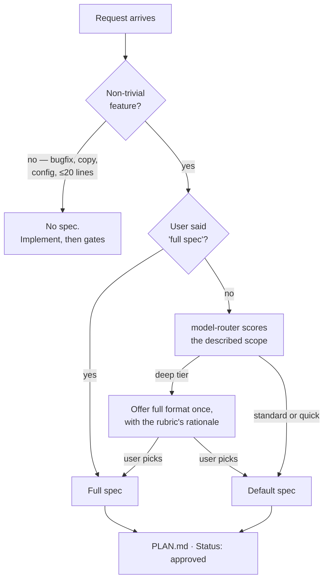

# Spec Gate — User Guide

When a spec is required, which of the two formats to write, and what the gate actually blocks.

This is the mechanism `USER_GUIDE.md` calls "the whole point" of the harness, seen from both sides: the discipline in `task-workflow`, and `spec-gate-guard.mjs` enforcing it at edit time. For the surrounding loop see [`USER_GUIDE.md` §4](USER_GUIDE.md#4-day-2-onward--the-daily-loop); for the gate's sibling guards, [§6](USER_GUIDE.md#6-living-with-the-gates).

**Contents**

1. [What the gate is for](#1-what-the-gate-is-for)
2. [When a spec is required](#2-when-a-spec-is-required)
3. [The two formats](#3-the-two-formats)
4. [Choosing between them](#4-choosing-between-them)
5. [PLAN.md — what both produce](#5-planmd--what-both-produce)
6. [What the guard actually checks](#6-what-the-guard-actually-checks)
7. [Getting blocked](#7-getting-blocked)

---

## 1. What the gate is for

**Problem it solves:** an agent that starts editing before the shape of the change is agreed will produce something plausible, large, and subtly not what you wanted — and you'll discover that at review, when it's a rewrite rather than a sentence.

The gate forces one decision to happen first: **what are we building, and what are we explicitly not building.** Everything downstream depends on that artifact existing. The verifier audits the diff against `PLAN.md`, never against the implementer's own account of what it did. `model-router` scores the tier from the planned file list. Step 6 can't close while a task row is open. Remove the plan and each of those loses its reference point.

It's enforced in two places, which is why it holds:

- **`task-workflow`** — the discipline. Write the spec, wait for approval, then write `PLAN.md`.
- **`spec-gate-guard.mjs`** — a `PreToolUse` hook that blocks non-trivial `Edit`/`Write`/`MultiEdit` when no approved plan exists. It doesn't trust the agent to have followed the skill.

---

## 2. When a spec is required

Non-trivial feature work. **Skipped** for bug fixes, copy changes, config tweaks, and changes under ~20 lines of logic.

If the request doesn't carry enough information to fill the required sections with confidence, the workflow asks **up to three targeted questions** before drafting. It does not fill gaps with silent assumptions and hand you an approved-looking spec built on them — that's the failure the gate exists to prevent, reintroduced one level up.

Two things are always required, in both formats:

**Security considerations.** If the feature touches auth, sessions, secrets, PII, or untrusted input (user-controlled data, URLs, redirects, file paths), the section must name concrete risks — not "we'll be careful." Otherwise `N/A` with the reason. The economics are the argument: a threat found at spec time is a sentence; the same threat found at code review is a rewrite.

**Not in scope.** Explicit exclusions. This is the line that makes "stop and ask" enforceable later — without it, scope creep has nothing to violate.

---

## 3. The two formats

### Default

Six fields, pasted in chat, approved before any code:

```
## Spec: {feature name}
What: {one paragraph — what changes and why}
Inputs/outputs: {what data flows in and out}
Edge cases: {anything that could go wrong}
Security considerations: {concrete risks, or N/A with the reason}
Testing strategy: {unit/integration/manual, which edge cases get coverage}
Not in scope: {explicit exclusions}
```

This is the right format for nearly everything. It's short enough to read properly, which matters more than completeness — an unread spec approves nothing.

### Full spec (opt-in)

Marked `[full-spec]` in the heading. Seven sections, and **you omit the ones that don't apply** — no Component Tree for backend work, no API Contract for UI-only work, no Data Model if nothing new is persisted. Padding it defeats the purpose.

```
## Spec: {feature name} [full-spec]
User Stories & Scenarios: {Given/When/Then, only if more than one flow}
Requirements: {FR-1, FR-2, … as bullets; table only at 5+}
API Contract: {typed request/response — only if an API changes}
Data Model: {interfaces/types — only if persisted/shared data changes}
Component Tree: {frontend only, multi-component work only}
Security considerations: {always required}
Verification Checklist: {Automated: tests/lint/typecheck. Manual: happy, error, edge}
Not in scope: {explicit exclusions}
```

A filled-in example lives in [`skills/task-workflow/references/full-spec-example.md`](../skills/task-workflow/references/full-spec-example.md).

What the full format buys you is **traceability**, not length. Numbered `FR-` requirements give the `PLAN.md` task table something to point at, and the Verification Checklist becomes tracked rows that must close before the task can. That's the whole difference — if you don't need requirement IDs, you don't need this format.

---

## 4. Choosing between them

There are exactly two ways the full format gets used. Everything else is the default.



**Path one — you ask for it.** "Full spec", "AI-friendly spec", "spec-driven". That's an explicit signal and it's honored.

**Path two — the rubric offers it.** `model-router`'s capability scoring runs against the *described* scope, using the files the request implies via `--paths`, since no `PLAN.md` exists yet. If that scores the `deep` tier, the full format is offered **once**, with the rationale, and you pick.

The rule that keeps this from inflating: **a `standard` or `quick` score is not a reason to raise formats at all**, and the format is never upgraded because a task *feels* big. That judgment belongs to the rubric, not to a vibe. Step 4 reuses the same score rather than re-running it, unless the approved spec moved the scope out from under it.

Worth knowing in the other direction: a full-spec `PLAN.md` on disk sets `fullSpecDetected`, which is an **auto-override to the deep tier** in later scoring. Choosing the full format is therefore also a routing decision — it commits the implementation to the most expensive tier. That's usually right for work that earned the format, and it's a reason not to reach for it casually.

---

## 5. PLAN.md — what both produce

One file. The approved spec, then a tracking table, updated in place — never a second progress doc.

```
# Plan: {feature name}

Status: approved
Branch: {git branch --show-current}

## Spec
{the approved spec}

## Tasks
| # | Task | Status | Notes |
|---|------|--------|-------|
| 1 | {task} | Not started | |
```

Statuses: `Not started`, `In progress`, `Done`, `Blocked`.

**`Status: approved` is what the guard greps for.** A plan you're still drafting doesn't unlock edits.

**`Branch:` stops a leftover plan from governing the wrong task.** If it disagrees with `HEAD`, non-trivial edits are blocked. Omit it when there's no branch to name (detached `HEAD`, not a repo) and the check is skipped — the guard never blocks on what git can't answer. On a deliberate rename or rebase, update the line rather than deleting it.

**Full-spec tier adds two things** the default tier must not have: a `Covers` column linking each task to its `FR-`, and one tracked row per manual Verification Checklist item. Cleanup can't run while any of those rows is open. Default-tier plans have no FR-IDs to reference, so adding the column there is noise.

After the coverage check, tasks are mirrored into Claude Code's task list for visibility — **one-way and disposable**. `PLAN.md` is the source of truth. The guard and the verifier both read the file off disk and can't see session task state at all; that asymmetry is deliberate.

`PLAN.md` is deleted at step 6. It's a working file, not documentation — and step 6's distill prompt is the last chance to move anything durable in it into `knowledge/` (see [`KNOWLEDGE.md` §4](KNOWLEDGE.md#4-role-in-each-task-workflow-step)).

---

## 6. What the guard actually checks

`spec-gate-guard.mjs` runs on every `Edit`, `Write`, and `MultiEdit`, in this order. Knowing the order explains most surprises.

1. **No `file_path`** → allow.
2. **Trivial path** → allow, regardless of plan status. Anything under `tests/`, any `.md`, `.env.example`, `graphify-out/`, and the common config files (`eslint`, `prettier`, `tsconfig`, `vite`, `vitest`, `nuxt`, `.editorconfig`, `.gitignore`, `.npmrc`).
3. **Git-ignored path** → allow. Build output isn't reviewable source. This check is deliberately **index-aware**: a *tracked* file that merely matches a `.gitignore` pattern is still gated, which is exactly why `graphify-out/` needs its own rule in step 2 — it's committed by design.
4. **Approved plan for this branch** → allow.
5. **Otherwise, measure the change.** Over 20 lines → block.

The size measure is worth knowing precisely, because it's a **proxy** for the skill's "≤20 lines of logic" rule, not the same thing:

| Tool | Counted as |
|---|---|
| `Edit` | `max(old_string, new_string)` line count |
| `MultiEdit` | the **sum** of each edit's max — several small edits add up |
| `Write` (existing file) | the absolute difference in line count |
| `Write` (new file) | the full content length |
| anything else | `Infinity` — always gated |

So creating a 50-line file needs a plan, and reformatting 200 lines into the same line count doesn't. That's a deliberate trade for a check that has to be instant and can't read intent.

The guard **fails closed**: an unparsable hook payload prints a diagnostic and exits 2. A bare parse error would exit 1, which Claude Code treats as non-blocking — the gate would silently stop gating.

And you can't route around it: `bash-guard.mjs` blocks `--no-verify`, `git commit -n`, and `git push --force`.

---

## 7. Getting blocked

Two messages, two different causes.

**`PLAN.md missing or not approved`** — the gate working as designed. Legitimate ways forward:

- Get the spec approved and write `PLAN.md`. The normal path.
- Keep the change ≤20 lines, if it genuinely is that small.
- Notice the file should have been trivial — a test, a doc, a config — and check whether the path pattern actually covers it.

**`PLAN.md is for branch 'X' but HEAD is 'Y'`** — a plan left over from another task. Finish it, update its `Branch:` line if you deliberately rebased or renamed, or delete it. Don't blank the `Status:` line to get moving; that leaves a plan on disk that the verifier may still pick up.

Neither is an invitation to bypass. If the gate blocks something it shouldn't, the fix is the path allowlist or the threshold in `.claude/rules/`, changed deliberately — not `--no-verify`, which is blocked anyway.

> One workflow note: running several tasks at once needs a worktree per instance, because `PLAN.md` and the gate are per-directory. See [`references/parallelization.md`](../skills/task-workflow/references/parallelization.md).
