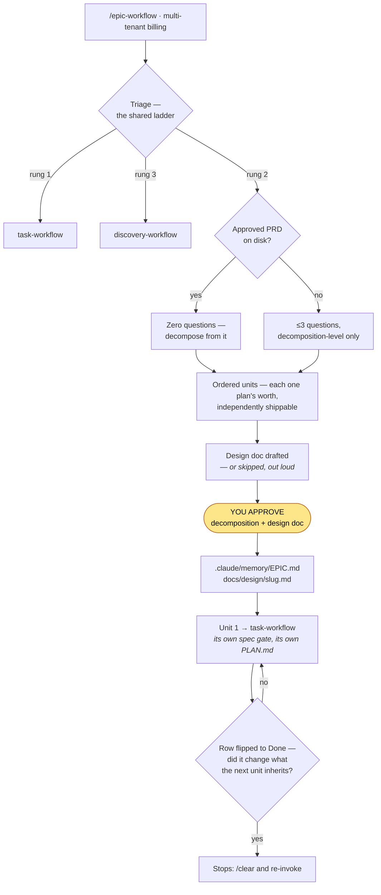

# BigIn Skills — User Guide

A practical, task-oriented guide to using the `bigin-skills` plugin day to day.

**Never used this before?** Start with the [handbook](https://bigin-skills.pages.dev/handbook) (source: [`site/src/pages/handbook.html`](../site/src/pages/handbook.html)). It covers why the harness exists, the concepts behind it, and the practices that make it work, in one readable pass. This guide is the task-oriented companion you come back to.

This guide is written for the person *using* the harness in a project, and it's the longest read you should need. [`README.md`](../README.md) is the short front door — install, the two commands, the skill and agent inventory. For a specific subsystem in depth, the guides linked from each section below go further than either. If you're changing the plugin itself, read [`CLAUDE.md`](../CLAUDE.md) and `.claude/rules/skill-authoring.md`.

**Contents**

1. [What this plugin actually does](#1-what-this-plugin-actually-does)
2. [Install it](#2-install-it)
3. [Day 1 — set up a repo](#3-day-1--set-up-a-repo)
4. [Day 2 onward — the daily loop](#4-day-2-onward--the-daily-loop)
5. [Which skill for which job](#5-which-skill-for-which-job)
6. [Living with the gates](#6-living-with-the-gates)
7. [Tuning cost and depth](#7-tuning-cost-and-depth)
8. [Knowledge: distilling what the team learns](#8-knowledge-distilling-what-the-team-learns)
9. [Long sessions and handoff](#9-long-sessions-and-handoff)
10. [Troubleshooting](#10-troubleshooting)
11. [Glossary](#11-glossary)

---

## 1. What this plugin actually does

Three things, in order of how much they matter:

1. **It makes the agent write a spec before it writes code**, and it enforces that with a hook — not with a paragraph in a doc that nobody reads. That's `task-workflow` + `spec-gate-guard.mjs`.
2. **It has a second agent check the first agent's work**, against the approved plan, without ever seeing the first agent's own account of what it did. That's the `verifier`.
3. **It standardizes the setup** — CLAUDE.md, path-scoped rules, commit gates, CI — so a repo run by a junior and a repo run by a staff engineer produce output at the same floor. That's `bigin-harness-setup`.

Everything else in the plugin (scaffolders, distillers, routers) exists to support those three.

**The core insight to internalize:** guidance defines intent, gates enforce it. Anything left to the agent's judgment varies run to run. So the value is concentrated in a handful of small hook scripts, not in the volume of markdown.

---

## 2. Install it

### Marketplace (recommended)

```
/plugin marketplace add tammai/bigin-skills
/plugin install bigin-skills@bigin
```

### npx

```bash
npx skills add tammai/bigin-skills
```

### Cursor

```
/add-plugin
```

Pick `bigin-skills`, or browse Customize → Plugins. To develop against a local checkout, symlink it instead:

```bash
ln -s "$(pwd)" ~/.cursor/plugins/local/bigin-skills
```

Both hosts load the same directories — the repo carries a manifest for each (`.claude-plugin/plugin.json`, `.cursor-plugin/plugin.json`) and the Cursor one points at the existing `skills/` and `agents/`, so there's a single copy of every skill.

One capability doesn't transfer: Cursor's agents don't accept the per-tier `model`/`effort` pins that `model-router` spawns with, so the subagent ladder ([§7](#7-tuning-cost-and-depth)) is Claude-Code-only. The skills, the workflow, and every gate work on both.

### Verify it's live

Start a session and type `/` — you should see `bigin-skills:task-workflow`, `bigin-skills:bigin-harness-setup`, and the rest in the skill list. (Cursor lists them without the `bigin-skills:` prefix.)

> **Don't install `bigin-harness-setup` standalone.** It calls sibling skills by repo-relative path (`node skills/nuxt-scaffold/scripts/scaffold.mjs`), so copying just that one directory breaks its empty-repo scaffold branches. The other skills copy cleanly on their own.

---

## 3. Day 1 — set up a repo

You do this **once per repo**. Say any of:

```
Set up a harness
Add AI rules to this repo
Scaffold the harness for this repo
```

### What happens

The skill detects your stack, asks a small batch of questions **before writing anything**, then generates the governance layer.

**Stack detection** (first match wins):

| Found | Profile |
| --- | --- |
| `src-tauri/tauri.conf.json` | `tauri` — checked **before** `nuxt`, because a Tauri desktop app with a Nuxt frontend has both markers, and matching `nuxt` first would onboard it as a web app: SSR left on, a `server/` BFF that does not exist at runtime, and no rule about capabilities, the IPC trust boundary or the updater key |
| `nuxt.config.ts` **plus** `@nuxt/content` and `@nuxtjs/i18n` in `dependencies` **plus** a `content/` tree or `content.config.ts` **plus** no `nuxt-auth-utils` or `@sidebase/nuxt-auth` | `nuxt-marketing` — also checked **before** `nuxt`, and for the same reason: a marketing site carries the `nuxt.config.ts` marker too, and matching `nuxt` first would write BFF-proxy, sealed-session and Pinia-Colada conventions for a repo with no BFF half and no auth. Conditions 3 and 4 are the narrowing test — a Nuxt fullstack app that happens to ship a docs section satisfies the first two and stays on `nuxt`, and `@nuxt/content` in `devDependencies` only is not a match. `server/api/**` is deliberately not tested: this profile's own form routes live there |
| `nuxt.config.ts` | `nuxt` |
| `go.mod` | `go` |
| `package.json` with express/fastify/hono/koa | `nodejs` |
| `next.config.*` | `next` |
| `pubspec.yaml` with a `flutter:` key or SDK dependency **and** app evidence (`lib/main*.dart` plus `android/app/` or `ios/Runner/`) | `flutter` |
| none of the above, but the repo has code | `generic` — no question asked, setup keeps going. A plain Dart package lands here, and so do a Flutter **package** and a Flutter **plugin** (`plugin:` under `flutter:`): flavors, a dio client and a local database are app concerns, and a widget library should not inherit rules for code it will never contain. The run says which one it detected. |
| empty repo | asks which stack, then scaffolds the app first — `nuxt-marketing` is option 7, and Phase 0.5 delegates it to `nuxt-marketing-scaffold` |

**The questions you'll be asked** (bundled, all optional to change — `AskUserQuestion` takes at most four at a time, so six applicable questions arrive as two back-to-back prompts):

| Question | Default | What it means |
| --- | --- | --- |
| Knowledge bundle & graph | knowledge + graphify | `knowledge/` holds decisions and invariants (the "why"); `graphify-out/` is a structural code graph for navigation |
| CI config | auto-detected from your git remote | Generates a workflow running lint + typecheck + test on push and PRs |
| Model ladder | `opus-centric` | Which models the three execution tiers spawn on — see [§7](#7-tuning-cost-and-depth) |
| Agent hosts | auto-detected — `both` if `.cursor/` exists, else `claude` | Whether to also generate the Cursor mirror so the same rules and gates apply in Cursor — see [`GATES.md` §7](GATES.md#7-the-same-gates-in-cursor) |

If the repo is empty, the app itself gets scaffolded first (by `nuxt-scaffold` / `nuxt-marketing-scaffold` / `next-scaffold` / `go-scaffold` / `nodejs-scaffold`, by `flutter create` for the `flutter` profile, or by `nuxt-scaffold` followed by `pnpm tauri init` for `tauri`), and the governance layer is overlaid on top additively. A `nuxt-marketing` repo that arrives from the Marketing Site Factory's template is already scaffolded and skips that step, like any other repo whose marker file exists.

If the repo is on GitHub Spec Kit, you'll be offered `migrate` / `coexist` / `leave`. Migration always shows you a read-only triage table of everything under `specs/` before deleting a single file.

### What you get

```
your-repo/
├── CLAUDE.md                   ← always loaded, ≤60 lines
├── AI_TASK_GUIDE.md            ← human pointer to /task-workflow
├── AI_REVIEW_CHECKLIST.md      ← definition of done
├── .claude/
│   ├── rules/                  ← path-scoped: load only when matching files are in context
│   ├── guards/                 ← the hooks that actually enforce things
│   ├── settings.json           ← pre-approved commands + hook wiring
│   ├── model-routing.json      ← which model each tier runs on
│   └── harness-version         ← what `patch` mode diffs against on a later re-run
├── tools/context_budget.mjs    ← always-loaded token budget gate
├── scripts/pre-commit.sh       ← lint + typecheck + test, fails closed
└── scripts/commit-msg.sh       ← Conventional Commits check, for every committer
```

The knowledge bundle and the graph convention are **on by default**, so unless you turned them
off you also get:

```
├── knowledge/                  ← index.md, the bundle spec, starter concepts, implementation/
├── tools/knowledge_validate.mjs ← structure gate, wired into pre-commit and CI
├── .claude/rules/knowledge.md  ← always loaded: the index-first read protocol
├── .claude/rules/graph.md      ← how to query the graph, when one exists
└── docs/graph-usage.md         ← query recipes for this repo
```

Plus CI (`.github/workflows/ci.yml` or `.gitlab-ci.yml`) if you let setup generate it, and if you
opted into Cursor:

```
├── AGENTS.md                   ← generated from CLAUDE.md; what Cursor loads
├── .cursor/
│   ├── rules/*.mdc             ← generated from .claude/rules/; paths: → globs:
│   └── hooks.json              ← registers the same guards (nine, or ten on a polyrepo consumer repo)
└── tools/cursor_mirror.mjs     ← regenerates the mirror; --check gates the commit
```

`.claude/` stays canonical. Edit `CLAUDE.md` or `.claude/rules/`, run `node tools/cursor_mirror.mjs`, and commit both sides — the pre-commit gate fails the commit if you forget.

### After setup

One thing to do by hand:

```bash
# Read CLAUDE.md — it's short by design, and it's what every session sees
```

The git hooks used to be the other one. They now install themselves: setup registers a `Setup` hook
(`.claude/guards/install-hooks.mjs`) that symlinks whichever of `scripts/pre-commit.sh` and
`scripts/commit-msg.sh` your repo has, on the first Claude Code run in any clone — which matters
because `.git/` isn't tracked, so a teammate cloning later previously started with no gates at all
and nothing telling them. Where `simple-git-hooks` or `husky` owns the hooks it prints that tool's
install command instead of fighting it, and it never replaces a hook it didn't create.

Cursor has no `Setup` event, so if you work there, run the two commands by hand:

```bash
ln -sf ../../scripts/pre-commit.sh .git/hooks/pre-commit && chmod +x scripts/pre-commit.sh
ln -sf ../../scripts/commit-msg.sh .git/hooks/commit-msg && chmod +x scripts/commit-msg.sh
```

Skip either line whose script your repo doesn't have — where `simple-git-hooks` or `husky` is
already in use, its own install step covers that hook instead, and setup leaves it alone. The exact
pair for your repo is in the Phase 7 summary; the onboarding block it prints is what to hand a new
teammate.

Re-running setup later is safe. It's idempotent: `settings.json` is merged, `README.md` is append-only, and nothing is clobbered without asking you first.

**Two re-run modes worth knowing.** `patch` reads this plugin's `CHANGELOG.md` and applies only the changes between the version your repo was scaffolded with (`.claude/harness-version`) and the current one — that's how an already-set-up repo receives a fixed guard or a tightened permission without a full overwrite. `verify` re-checks an existing `CLAUDE.md` against the repo and **corrects or removes claims that no longer hold**: it runs each lint/typecheck/test command before trusting the row that names it, so a command that stopped existing is rewritten rather than left as a confident lie. A verify pass may shrink `CLAUDE.md` or leave it the same size — one that grows it is a bug. `patch` is the opposite by design: it applies deltas, so it can add a file or a line, and it never touches a target it can't match exactly, reporting those for you to apply by hand instead.

### Six repos at once

A BigIn client project usually isn't one repo — it's six: `<slug>-specs`, `-contracts`, `-api`, `-web`, `-mobile`, `-qa`. `project-scaffold` stands all six up in one run, which by hand is about twenty steps:

```
Set up a new polyrepo project called acme
```

It creates each repo, **delegates each code repo to the scaffolder that already owns it** — `go-scaffold` for `api`, `nuxt-scaffold` for `web`, `flutter create` for `mobile`; a missing toolchain skips that one and names it in the summary rather than failing the run — and writes the connective tissue nothing else owns: `REPO_MAP.md`, each consumer's `api-contract.lock`, `story-sync.json`, the sync scripts, and the CI workflows with each repo's toolchain filled in. A project with no mobile app, or no second frontend, is the same command with the types it does have — `--repos specs,contracts,api,web,qa` — and adding one later is that flag again, which unions the new repo into the specs repo's `STORY_CONSUMERS` rather than replacing the list.

**It asks one question you can't take back cheaply:** create the GitHub repos now, or set up locally first. Local-only is a real mode — remotes get added later by re-running with `--owner`. If you do want them, it makes you confirm the **owner** explicitly and never infers it from `gh auth status`; six repos appearing in an organisation nobody meant to touch is the accident worth one extra question. CI credentials are opt-in the same way: `--app-id`/`--app-key` set `CONTRACT_APP_ID` and `CONTRACT_APP_PRIVATE_KEY` on every repo, with the key piped from disk to `gh` — never read into the script, logged, or copied. `STORY_CONSUMERS` — the specs repo's list of who receives synced stories — is wiring rather than a credential, so `--owner` alone sets it.

Then run harness setup **once in each of the six**:

```
Set up a harness
```

That second step is deliberate, not an oversight: `project-scaffold` writes no `CLAUDE.md`, no rule file, no guard and no `settings.json`. `bigin-harness-setup` owns the governance layer, and a second implementation inside the scaffolder would drift the day either one changed. Phase 0a reads the repo-name suffix, confirms the type with you, and installs that profile — plus, on `api`/`web`/`mobile`, the consumer overlay and `vendored-contract-guard.mjs`.

Write the real contract in the contracts repo, tag it, then in each consumer `node scripts/contract_sync.mjs bump <tag>` records the commit and checksum, vendors the spec, and regenerates the client **in one commit** — the invariant everything downstream depends on.

**Three things it can't do for you**, each named in its summary when it applies:

1. **Create the GitHub App** — web UI only, and until it exists *and is installed on the owner*, every dispatch fails at "Mint an App token" with a 404.
2. **Fix Actions billing** — a failed payment or a $0 spending limit blocks Actions across every repo the account owns, and the symptom is a job dying in about three seconds with no log. Check it before blaming a workflow.
3. **Seed `.bmad-core`** — BA workflow depth is a deliberate placeholder; the specs repo gets the directory structure and `story_lint.mjs`, not a story template.

None of that blocks you: everything the standard needs beyond CI works without it — `bigin-harness-setup/references/ci.md` → "Running the standard without CI".

The standard itself — repo model, session boundaries, the sidecar convention — is [`docs/polyrepo/README.md`](polyrepo/README.md), and [`PILOT.md`](polyrepo/PILOT.md) is the run that proved it on live repos.

---

## 4. Day 2 onward — the daily loop

**`task-workflow` is the thing you actually use.** Harness setup happens once; this runs dozens of times a day.

Trigger it with plain language — "implement X", "add a feature", "fix the bug in Y", "create a new endpoint" — or explicitly with `/task-workflow`.

### The six steps, and what you do at each

| Step | What the agent does | What **you** do |
| --- | --- | --- |
| **1. Scope + triage** | States in one sentence what's changing and why, then checks it against the shared ladder. **Only rung 1 continues** — rung 2 stops and hands to `epic-workflow`, rung 3 to `discovery-workflow` | Skim it. If it misread you, correct it now — it's one sentence, not a diff. |
| **2. Spec gate** | Drafts a spec and **stops** | **Approve, edit, or reject.** Nothing downstream can fix a spec you waved through. |
| **3. Plan file** | Writes the approved spec + task table to `PLAN.md`, reads it back for coverage, then mirrors the rows into Claude Code's task list (3+ rows only — one-way and disposable; `PLAN.md` stays canonical) | Nothing. |
| **4. Implement/verify** | Routes to a tier, implements, then spawns an independent verifier. Loops up to 3× on FAIL. Skipped entirely only when the spec gate was skipped **and** the verification bar came back "normal gates" — then it implements inline and just runs lint/typecheck/tests. | Nothing, unless the tier comes back `deep-architect` (it asks) or the round cap is hit. |
| **5. Review** | Asks whether to run `/code-review` (+ `/security-review` if the change touches auth/secrets/PII/untrusted input) | Say yes or no. Neither runs automatically. |
| **6. Cleanup** | Archives `PLAN.md` verbatim out of the repo root, proposes distilling anything durable into `knowledge/`, proposes a graph rebuild | Approve or decline the proposals. |

### The spec gate is the whole point

Full guide — when a spec is required, choosing between the two formats, and exactly what the guard measures: [`SPEC-GATE.md`](SPEC-GATE.md).

For non-trivial features, the agent pastes this in chat and waits:

```
## Spec: {feature name}
What: {one paragraph — what changes and why}
Inputs/outputs: {what data flows in and out}
Edge cases: {anything that could go wrong}
Security considerations: {who/what is trusted, what's attacker-controlled}
Testing strategy: {what gets tested and how}
Not in scope: {explicit exclusions}
```

**Read the "Not in scope" and "Edge cases" lines first.** Those are where a misunderstanding is cheapest to catch. A wrong assumption fixed here costs one sentence; found after implementation it costs a rewrite.

The spec gate is **skipped** for bug fixes, copy changes, config tweaks, and changes under ~20 lines of logic. That's deliberate — it isn't there to gate typo fixes.

If the request is too vague to fill the spec confidently, the agent asks up to 3 targeted questions rather than inventing assumptions and presenting them as approved.

### Want more rigor on a big change?

Say **"write a full spec"** / **"AI-friendly spec"** / **"spec-driven"**. That adds User Stories, numbered Functional Requirements, an API Contract, a Data Model, a Component Tree (frontend only), and a `Covers` column linking every task to the requirement it implements.

It's **opt-in only** — the workflow will never escalate to it because a task "feels big." The single exception: if capability scoring comes back `deep-architect`, it offers the full format once, with its reasoning, and you pick.

### The implement/verify loop, concretely

```
model-router scores the task
        ↓
  spawns quick-executor | standard-worker | deep-architect
        ↓
  implementer writes code, runs lint + typecheck + tests itself
        ↓
  a FRESH verifier subagent audits the DIFF against PLAN.md
   (read-only, no memory, never sees the implementer's summary)
        ↓
   PASS → Review          FAIL → the fix is applied (usually by the
                                 same implementer, resumed with the
                                 issue list verbatim), then a NEW
                                 memoryless verifier re-checks
                                 (capped at 3 rounds)
```

Three properties worth knowing:

- **The verifier reads the diff, not the report.** An implementer that says "done, all tests pass" gets audited on the actual code either way.
- **The cap is real.** At 3 failed rounds it stops and asks you whether to adjust the plan, raise the cap, or take over. It does not loop forever.
- **Who types the fix is not the independence.** For a genuinely trivial issue — one the verifier already names the correct value for, text rather than behaviour, a couple of lines in a file the diff already touches — the orchestrator applies it directly instead of paying a full implementer resume to change two words. Every issue on the list has to clear that bar or the whole list goes back to the implementer, and a fresh verifier still re-checks the result either way. The audit is where independence lives.

### Scope discipline

If implementation reveals the task needs changes outside the stated scope, the workflow **stops and asks**. It never expands silently. A second task beats a sprawling first one.

That covers work the task *turns out to need*. It's not the same as the requirement itself changing — that's next.

### When the requirement changes mid-task

You change your mind, or implementation reveals a spec assumption was wrong, and rows in `PLAN.md` are already `Done`. Three things look identical from inside the loop and only one of them is this:

| What happened | What handles it |
| --- | --- |
| The code missed the plan | The verifier — `FAIL`, then a fix round |
| The task needs work outside its scope | Scope discipline — stop and ask, second task |
| **The requirement moved** | **Course correction** |

What you'll see, in order:

1. **The plan freezes.** `Status:` in `PLAN.md` flips to `amending`, and the spec gate — which only passes `approved` — blocks non-trivial edits until you re-approve. No new gate; the existing one just stops letting work through against a spec that's mid-rewrite.
2. **The change gets classified out loud**, because the three cost different amounts: **additive** (new rows, nothing done is invalidated), **invalidating** (a `Done` row is now wrong and gets flipped back with a reason), or a **premise change** (the goal moved, not the requirements — the plan is replaced from the spec gate, not patched).
3. **It's logged** to an `## Amendments` section in `PLAN.md`. That's the only record of why the plan's shape changed; cleanup's distill step reads it before the plan leaves the repo root, and the archive then carries it forward verbatim.
4. **You re-approve** — the changed sections and rows, as a diff, not the whole spec re-pasted. Then `Status:` goes back to `approved` and the loop resumes.

Two limits worth knowing: amendment rounds **don't** count against the 3-round fix-loop cap (different failure mode), and there's a cap of **2 amendments per plan** — a third means the scope was wrong from the start, so it stops and re-scopes instead of looping.

### When the work is bigger than one task

If the request needs three or five plans rather than one, `epic-workflow` runs first and `task-workflow` runs underneath it:



Four things to hold onto:

- **Approving an epic approves the decomposition and its design doc, nothing else.** Every unit still faces the spec gate on its own merits. `EPIC.md` deliberately doesn't satisfy the guard — one epic-level approval standing in for five unwritten specs is exactly the drift the gate exists to stop.
- **One unit at a time, and it usually keeps going.** Most of a unit's weight never reaches your session — the implementer and the verifier are subagents — so it continues to the next unit rather than stopping by default. It stops and asks you to `/clear` when context is genuinely tight, or when the finished unit changed something the next one inherits and you should see that before its spec is drafted. The queue file is the complete handoff package either way, so a `/clear` at any point costs nothing.
- **It writes a design doc, when the epic earns one.** The decomposition says what the units are; the design doc says how the initiative is built and what was rejected — context, goals and non-goals, the design opening with a `mermaid` diagram, alternatives considered, cross-cutting concerns, risks. One to three pages at `docs/design/{slug}.md`, approved at that same single gate. It is skipped when the shape is obvious or every unit follows a pattern the repo already has — but the skip is said out loud, in one sentence, because a silent one is indistinguishable from forgetting. Template and the bar for writing one: [`skills/epic-workflow/references/design-doc.md`](../skills/epic-workflow/references/design-doc.md).
- **It refuses in both directions.** Below the bar it hands straight back to `task-workflow`; above ~8 units it says the scope is a roadmap, proposes the first epic-sized slice, and names what it deferred.

Epic cleanup is also where the `knowledge/` distillation usually pays off. A single `PLAN.md` rarely establishes anything durable; an epic that settled a contract or a boundary did — and each decision the design doc settled becomes one [MADR](https://adr.github.io/madr/)-shaped file under `knowledge/architecture/`. The design doc itself is never archived: it stays as the entry point for whoever touches that system next, with its `Status:` line updated where reality diverged from it.

### When nobody can say what the thing is yet

`epic-workflow` assumes the initiative arrives already stated, and `task-workflow` assumes the task does. When neither is true — a client says "we want a portal", or the ask is a new product surface nobody has written acceptance criteria for — `discovery-workflow` runs first:

```
/discovery-workflow "we want a client portal"
        ↓
  triage — the shared ladder: rung 1 → task-workflow · rung 2 → epic-workflow · rung 3 → continue
        ↓
  read the repo before asking anything (and run every command before writing it down)
        ↓
  structured elicitation, hard-capped — 3 rounds, 12 questions, then it writes anyway
        ↓
  YOU APPROVE THE BRIEF        ← nothing on disk before this
        ↓
  docs/product/brief.md
        ↓
  YOU APPROVE THE PRD          ← also the privacy checkpoint: roles, never people
        ↓
  docs/product/prd.md — numbered FR-n requirements, acceptance criteria each
        ↓
  knowledge/architecture/*.md for the decisions the product forced (skipped, loudly, with no bundle)
        ↓
  hands the PRD path to epic-workflow, then STOPS
```

Three things to hold onto:

- **The PRD is a contract, not a document.** It is written so that `epic-workflow` can decompose from its requirement index and `Depends on:` lines and `write-tests` can generate from one acceptance criterion. `epic-workflow` reads an approved PRD itself, at its own step 2 — zero clarifying questions when one exists and covers the initiative. `write-tests` reads it too: cite it `FR-3/AC-2` and it resolves the criterion off disk and writes an E2E spec around the PRD's own words (quoting a criterion inline still works, with no PRD needed). `task-workflow`'s full-spec `Covers` column also takes requirement IDs. All three cite by ID, which is why requirement IDs are assigned once and never renumbered — a tidy-up silently re-points every citation at requirements nobody wrote.
- **Two homes, and nothing crosses.** Product artifacts are human-facing docs under `docs/product/`; architecture decisions are agent-facing OKF concepts under `knowledge/architecture/`. A requirement never lands in `knowledge/`, and an invariant never lands in the PRD.
- **It adds no gate either.** Approval is conversational, at those two stops. Nothing at commit time reads a brief or a PRD, and an approved one is never overwritten — re-invoking on a finished discovery reports state and hands off.

Skipping it is fine and often right. A repo with no PRD keeps working exactly as before; a repo with one has the answers to the decomposition's questions already written down, and `epic-workflow` checks for the PRD itself at its own step 2 — no need to point it there.

### Running several tasks at once

One `PLAN.md` per worktree. Spec-gate approval is **per-worktree** — approving a plan in one instance never carries over to another. See [`skills/task-workflow/references/parallelization.md`](../skills/task-workflow/references/parallelization.md) for the worktree-per-instance pattern and the 3–4 task cascade.

---

## 5. Which skill for which job

| You want to… | Say | Skill |
| --- | --- | --- |
| Understand something as a picture | `/napkin <topic>` — typed explicitly | `napkin` — offers 2-4 candidate shapes first, then draws your pick: HTML artifact by default, SVG or PNG when the diagram has to live in a doc or a message |
| Not know which of these you want | `/ask-bigin where do I start` — typed explicitly; it never triggers on its own | `ask-bigin` — routes and hands off; it never does the work itself |
| Set up a new repo | "set up a harness" | `bigin-harness-setup` |
| Build a feature / fix a tracked bug | "implement X", "fix Y" | `task-workflow` |
| Break an initiative into shippable units | "this is too big for one task" | `epic-workflow` |
| Work out what to build at all | "we want to build X", "write a PRD" | `discovery-workflow` |
| Write tests for one function, or one PRD criterion | "write tests for `parseToken`" / "e2e test for FR-3/AC-2" | `write-tests` — routed on what the request names |
| Debug something not yet in a plan | "why is this flaky", "debug this" | `debug-workflow` |
| Start a Nuxt / Next / Go / Node app from nothing | "scaffold nuxt", "create go rest api" | `*-scaffold` |
| Start a Flutter app from nothing | "set up a harness" in an empty dir | `bigin-harness-setup` → `flutter create` (no scaffold skill — see below) |
| Start a Tauri desktop app from nothing | "set up a harness" in an empty dir | `bigin-harness-setup` → `nuxt-scaffold`, then `pnpm tauri init` (no scaffold skill — `create-tauri-app` has no Nuxt template) |
| Capture a sprint's learnings | "sprint distill" | `sprint-distill` |
| Pin a fast-moving library's API | "distill knowledge for nuxt@4.0.3" | `knowledge-distill` |
| Save state before hitting a limit | "save session" | `session-handoff` |
| Implement a Nuxt UI Figma handoff | paste the Figma URL | `nuxt-ui-figma-handoff` |
| Implement a Material 3 Figma handoff in Flutter | paste the Figma URL | `flutter-figma-handoff` — components resolve via a mapping table; an unmapped one stops the handoff |
| Absorb an API contract bump | "absorb the contract bump", "our openapi.yaml is stale" | `contract-sync` — pinned-commit vendoring + codegen, in a repo that consumes a contracts repo |
| Start a whole polyrepo project | "set up a new polyrepo project called X" | `project-scaffold` — the six repos and everything between them; run `bigin-harness-setup` in each afterwards |
| Decide which model runs a task | "route this task" | `model-router` |

### The five that overlap most

You don't have to get the door right. `task-workflow`, `epic-workflow` and `discovery-workflow` all triage through **one shared ladder** — [`triage-ladder.md`](../skills/discovery-workflow/references/triage-ladder.md), three rungs, written once and read by all three — so the same request reaches the same depth whichever one you invoke. Ask for a copy fix inside `discovery-workflow` and it hands you down to rung 1 rather than writing a brief; ask for "we want a portal" inside `task-workflow` and it hands you up to rung 3 rather than spec'ing over the gap. The two middle pairs below are that ladder's two boundaries in prose; the first and last are about skills that sit beside the ladder rather than on it — `write-tests` routes on what a request *names*, and `debug-workflow` is a qualifier on rung 1, not a rung of its own.

**`write-tests` vs `task-workflow`** — `write-tests` is for "I need tests for this one function, now." A full feature going through `task-workflow` calls `write-tests` internally for its test authoring; you don't need to invoke both.

**`epic-workflow` vs `task-workflow`** — `task-workflow` takes one task to shipped code. `epic-workflow` decides what the tasks *are*: it decomposes an initiative into ordered units, each sized to one `PLAN.md`, and then hands them back to `task-workflow` one at a time (continuing in-session by default, stopping when a unit changed what the next inherits — the queue file in `.claude/memory/EPIC.md` is the handoff package). Use it only for rung 2 — 3+ plans, more than one PR, or two-plus surfaces; below that bar, decomposing costs a session and buys nothing. Approving an epic approves the *decomposition* only — every unit still faces the spec gate on its own.

**`discovery-workflow` vs `epic-workflow`** — both sit above the task loop, and the split is the rung-2/rung-3 boundary: whether the *product* question is settled. If you can already write one testable acceptance criterion for the request exactly as stated, inventing nothing, it's an epic (or a task) and discovery would just manufacture paperwork. If writing that one criterion means deciding who the user is or what "done" means, that's discovery, and it ends by handing `epic-workflow` a PRD.

**`debug-workflow` vs `task-workflow`** — if the bug already has a `PLAN.md`, `task-workflow` owns it and points at `debug-workflow` for the actual debugging. Use `debug-workflow` standalone when the failure isn't tied to a ticket yet: a flaky test, a stack trace, "works in staging not prod," a live incident.

**`ask-bigin` vs just saying what you want** — this is the one worth being clear about, because the wrong choice costs a turn for nothing. If you can state the work ("implement X", "fix Y", "write tests for `parseToken`"), say that: the skill you need triggers on it directly, and going through a router first adds a hop and answers a question you'd already answered. `ask-bigin` is for the other case — you don't know what's available, you're between two skills, or you want the inventory. It routes and stops; it never does the work, so it is never the faster path to work you can already name. This is enforced rather than advised: it sets `disable-model-invocation`, so it only ever runs when you type `/ask-bigin`, and Claude cannot insert it in front of a request you already stated clearly.

`debug-workflow` triages first: obvious bugs take a fast path, while flaky / environment-dependent / repeat failures take the full repro → evidence → hypothesis → fix → prevention workflow. **Every path ends with a regression test** — and in a harnessed repo that's enforced at commit time, not requested politely.

---

## 6. Living with the gates

The gates will block you sometimes. That's the point — but knowing *why* turns a blocker into a two-second fix.

Full guide — every guard, the three-stage injection gate, fail-closed behavior, and how to test one by hand: [`GATES.md`](GATES.md).

### `spec-gate-guard.mjs` — "no approved PLAN.md"

**Blocks:** non-trivial `Edit`/`Write`/`MultiEdit` when `PLAN.md` is missing, not `Status: approved`, or its `Branch:` line disagrees with the branch you're on.

**Exempt:** `tests/**`, `*.md`, `.env.example`, common config files, `graphify-out/**`, anything **git-ignored** (build output, caches — a path that never reaches the diff has nothing to spec), and any edit ≤20 lines. Note that "git-ignored" is index-aware: a *tracked* file that merely matches a `.gitignore` pattern is still gated.

**Fix:** run `/task-workflow` and approve the spec. If it's a leftover plan from a finished task, delete `PLAN.md` — that's exactly what the `Branch:` check exists to catch.

If the plan says `Status: amending`, the block is deliberate: a course correction is waiting on you to re-approve the amended spec. Approve it rather than editing the `Status:` line back yourself — see [§4](#when-the-requirement-changes-mid-task).

### `bugfix-test-guard.mjs` — "fix commit with no test"

**Blocks:** `git commit -m "fix: …"` (or `bugfix`/`hotfix`) with no staged test file.

**Allows:** once a `*.test.ts` / `*.spec.ts` / `*_test.go` / `*_test.dart` / `tests/**` file is staged; when every staged file is docs/config; or when the message contains `[no-test]`. Dart is matched by filename, not by directory, so a fix shipping only `integration_test/checkout_test.dart` counts.

**Fix:** stage the regression test. If there genuinely can't be one (a docs typo mislabeled `fix:`), add `[no-test]` — but that's an escape hatch, not a habit.

### `commit-msg-guard.mjs` — "not a Conventional Commit"

**Blocks:** `git commit -m "…"` when the subject isn't `type(scope): subject` — type one of `feat`, `fix`, `docs`, `style`, `refactor`, `perf`, `test`, `build`, `ci`, `chore`, `revert` — or when the subject runs past 100 chars.

**Allows:** `!` before the colon for breaking changes; `Merge`/`Revert`/`fixup!`/`squash!` subjects; any commit with no parsable `-m` (an `--amend`, or an editor-driven commit).

**Fix:** rewrite the subject, or move the detail into a body with a second `-m`.

Unlike `bash-guard.mjs`, this one binds you too: the same script is installed as a git `commit-msg` hook, so a commit typed in your own terminal gets the identical check. One implementation, two entry points — the rule can't drift between agent and human.

### `bash-guard.mjs` — "you can't disable your own gates"

**Blocks:** `--no-verify`, `git commit -n`, and `git push --force` / `-f` **on any branch** — the guard has no branch check, so a force-push to your own feature branch is blocked too. **Allows:** `--force-with-lease` anywhere, normal commits, and messages that merely contain `-n`. (The block message says "use `--force-with-lease` on a feature branch", which is advice about where force-pushing is reasonable, not a description of what the guard inspects.)

This one blocks the *agent*, not you. If you need to bypass a hook yourself, do it in your own terminal.

### The prompt-injection gates

Three stages, aimed at content the agent fetches rather than at you:

1. `injection-scan-guard.mjs` (PostToolUse) heuristically scans `WebFetch` / MCP responses and `curl`/`wget` output for injected instructions, and sets a session-scoped flag.
2. `injection-gate-guard.mjs` (PreToolUse) asks for confirmation on the next risky call if that flag is fresh (5-minute window), then clears it. Under Cursor it **denies** instead of asking — `preToolUse` there has no `ask` verdict, so the guard degrades to the safe side rather than falling through to allow.
3. `canary-seed.mjs` seeds a per-session random token the model is told never to reproduce. Any tool call containing it is **denied outright**, not asked — a per-session UUID has no legitimate reason to appear anywhere.

If you get a confirmation prompt right after the agent fetched a web page, that's stage 2. Look at what it fetched before saying yes.

### "could not parse its hook payload"

Every blocking gate fails **closed**: if it can't read the payload the host handed it, it blocks the call rather than letting it through unchecked. You'll essentially only see this if someone runs a guard by hand without piping a payload in — the recipe for doing that properly is in `bigin-harness-setup/references/hook-guard.md` → `## Testing a guard by hand`. If it ever appears during normal work, the hook payload format changed; fix the guard, don't delete it.

### `context_budget.mjs` — the always-loaded budget

Caps `CLAUDE.md` at 60 lines and unscoped rule files at 40. Runs in pre-commit. With Cursor parity installed it caps `AGENTS.md` and always-applied `.cursor/rules/*.mdc` the same way, and prints one budget line per host — each capped separately, since only one of them loads in a given session.

**Fix:** don't grow `CLAUDE.md`. Move the content into a path-scoped rule file under `.claude/rules/` with `paths:` frontmatter, so it loads only when matching files are in context. That's the three-tier loading model working as designed:

| Tier | What | Cost |
| --- | --- | --- |
| 1 | `CLAUDE.md` | every turn, always (~600 tokens) |
| 2 | `.claude/rules/*.md` with `paths:` | only when a matching file is in context |
| 3 | Skills like `/task-workflow` | only when invoked |

---

## 7. Tuning cost and depth

Full guide — the three ladders, how a tier is scored, the verification bar, and why effort isn't settable: [`ROUTING.md`](ROUTING.md).

Three execution tiers, each a subagent, plus the verifier. Your chosen ladder sets both the model and the effort of each.

| Tier | Subagent (default ladder) | Effort | Used for |
| --- | --- | --- | --- |
| Quick | `quick-executor` | low | Mechanical, single-file, low-risk |
| Standard | `standard-worker` | medium | Default — most feature and bug-fix work |
| Deep | `deep-architect` | high | Architecture, breaking contracts, row-transforming migrations |
| — | `verifier` | high | Read-only audit, spawned alongside whichever tier implemented |

`high` is the documented default effort, and **nothing pins above it on any ladder.** Quick and standard route *down* — mechanical and pattern-following work doesn't need full effort, especially with an approved `PLAN.md` already naming the files and edge cases. The checking a higher pin would buy is supplied structurally instead, by the verifier round.

### Pick a ladder

Set it in your repo's `.claude/model-routing.json`:

| Profile | quick | standard | deep | verifier | Pick it when |
| --- | --- | --- | --- | --- | --- |
| `opus-centric` (default) | sonnet/low | opus/medium | opus/high | sonnet/high | The cost-aware default. Standard runs at `medium` and leans on the verifier round; the deep tier escalates on **effort**, not on model. |
| `frontier` | sonnet/low | opus/high | fable/high | sonnet/high | Everything above quick at full effort, deep on the top model. Pay up front rather than per verifier round. |
| `lean` | sonnet/low | sonnet/high | opus/high | sonnet/medium | Cost-first, trading the other way: a cheaper standard tier run at *fuller* effort. Deep still escalates to opus. |

`opus-centric` is the only ladder that runs the standard tier below `high` — the other two differ from each other on model, not effort. Switch to `frontier` when you keep seeing either failure mode: standard-tier work returning verifier `FAIL`s, or a model that had full context, clearly tried, and still got the structure wrong.

Per-tier **model** overrides layer on top. There is no `effort` key — setting one is ignored with a warning:

```json
{ "profile": "opus-centric", "models": { "deep": "fable" } }
```

**Precedence:** something you say in the request ("run this one on fable") > `.claude/model-routing.json` > the `opus-centric` default. A malformed config never blocks routing — it degrades to the default and tells you. Deleting the file is safe.

### Why effort isn't a config key

Claude Code's Agent tool takes a `model` argument but no `effort` one — effort is read from the agent file being spawned. So when a ladder wants a tier at a different effort, the router spawns a *different agent file*: `standard-worker-high` under `frontier` and `lean`, `verifier-medium` under `lean`, each identical to its base except for the pin. The variant fixes only the effort — `standard-worker-high` still runs on `opus` under `frontier` and `sonnet` under `lean`.

You'll only notice this in the routing line ("Routed to standard-worker-high on sonnet"). What it does mean practically: **switching ladders changes effort, but a one-off request can't.** "Run this on fable" works; "run this at max effort" has nothing to set, and the router will tell you so rather than quietly ignoring it.

### Two axes, not one

`model-router` scores **capability** (can the model do this at all → picks the tier) and **verification** (how carefully must this be checked → sets the gate discipline) *separately*. A change can be mechanically simple and still need heavy verification — touching a contract, a migration, or CI. In that case the quick tier gets skipped in favor of `standard-worker`, even though the capability score was low.

Verification bar triggers: high-risk path, test coverage under 0.3, a planned new file, 5+ files, flaky symptoms.

### The one confirmation you'll see

If scoring lands on `deep-architect`, the workflow **pauses and asks** before spawning it — it's the most expensive tier (`opus/high` by default) and the biggest behavior swing. `standard-worker` and `quick-executor` spawn without asking.

Rationale per tier lives in [`skills/model-router/references/model-profiles.md`](../skills/model-router/references/model-profiles.md).

---

## 8. Knowledge: distilling what the team learns

Two skills exist to **distill** into `knowledge/`, and this section covers both. They cover different things and should not be confused.

They aren't the only writers. `discovery-workflow` records the architecture decisions a PRD forces ([§4](#when-nobody-can-say-what-the-thing-is-yet)), and `task-workflow` and `epic-workflow` each propose a concept at cleanup when a task or an epic settled something durable. The difference is what the writing *is*: for those, it's one step inside a larger job; for these two, it's the whole job.

Cleanup also writes a second, different thing. Beside any concept it proposes, `task-workflow` and `epic-workflow` archive the finished `PLAN.md` or `EPIC.md` **verbatim** into `knowledge/implementation/` as a `type: Record` — the plan, its tasks table, its amendments — or to `.claude/memory/PLAN.archive.<ISO>-<slug>.md` in a repo with no bundle. Concepts say what the system is and expire when behavior changes; records say how one piece came to be and never expire. Records sit behind their own nested index, so they never load for routine work — you go looking when you need to know why a past change took the shape it did. The boundary: [`KNOWLEDGE.md` §6](KNOWLEDGE.md#6-where-a-fact-belongs).

### `knowledge-distill` — external library APIs

**Problem it solves:** a library moved past the model's training data, so the agent confidently writes an API that no longer exists.

```
Distill knowledge for nuxt@4.0.3
Create a knowledge bundle for phaser
Update the nuxt bundle to 4.1.0
```

It clones the library at a **pinned commit**, distills its docs and source into concept files under `knowledge/libraries/<lib>/`, then hands the result to a fresh `knowledge-auditor` subagent that checks the bundle **against the library's own cloned source** — never against the distiller's account of what it wrote. Same independence principle as the `verifier`.

It **refuses "latest."** A bundle without a pinned version can't be audited or drift-checked. It also wires up a drift guard that compares the bundle's version against your declared dependency, so an upgrade doesn't silently leave stale docs behind.

### `sprint-distill` — what your team learned

```
Sprint distill
End-of-sprint review
```

Determines sprint scope from the last dated entry in `knowledge/log.md`, gathers merged PRs and touched concept files since then, and accepts pasted out-of-repo material (meeting notes, transcripts, client docs).

Every candidate learning is classified with a strict rule — **WHAT/WHY → `knowledge/`**, **HOW-we-work → `bigin-skills`**, **neither → dropped and reported**. Never both.

Then it **stops** and shows you the full set of proposed changes. Nothing is written until you approve.

**It compresses, never appends.** Net line delta for `CLAUDE.md` and `.claude/rules/` should be ≤0 across a sprint unless there's explicit budget headroom — every addition has to name what it replaces. That's the mechanism that stops the harness from bloating over a year.

Don't use it on a single PR. That's `/code-review`.

Full guide to the bundle — what opting in scaffolds, the two kinds of knowledge, what keeps it from rotting, and where a fact belongs: [`KNOWLEDGE.md`](KNOWLEDGE.md).

### Not the same thing: a code graph

`knowledge/` answers **why**. A code graph answers **where**. If you use graphify alongside the harness, [`GRAPHIFY.md`](GRAPHIFY.md) covers the split — and why graph output must never be written into `knowledge/`.

---

## 9. Long sessions and handoff

When you're nearing a usage limit:

```
Save session
```

`session-handoff` writes tasks, decisions, and uncommitted changes to `.claude/memory/SESSION.md`. If an epic is in flight, `.claude/memory/EPIC.md` sits beside it — keep them in their lanes: `EPIC.md` holds the unit queue and its amendment log, `SESSION.md` holds whatever is in flight right now. Name the epic and unit number in `SESSION.md` rather than copying rows across; two records of one queue drift within a day. On the next session start, `session-resume-check.mjs` (a `SessionStart` hook) sees `status: in-progress` and prompts you to resume or start fresh — deterministically, not by hoping the model reads a line of CLAUDE.md prose.

You also get this for free on automatic compaction: `precompact-snapshot.mjs` (a `PreCompact` hook) autosaves `SESSION.md` in the same format before context is compacted, so a mid-task compaction doesn't quietly lose in-flight state. It always exits 0 — a failed autosave never blocks compaction.

---

## 10. Troubleshooting

**"My edit was blocked and I don't have a PLAN.md."**
The spec gate is doing its job. Run `/task-workflow` and approve a spec — or, if the change is genuinely trivial, note that edits ≤20 lines and files under the trivial allowlist (`tests/**`, `*.md`, config) pass through untouched.

**"I have a PLAN.md and it's still blocked."**
Check two lines: `Status:` must read `approved`, and `Branch:` must match `git branch --show-current`. A plan left over from a finished task on another branch is the usual cause. Delete it.

**"The verifier keeps failing the same thing."**
At 3 rounds the loop stops and shows you the issue list. Usually the plan is wrong, not the code — the implementer is doing what `PLAN.md` says and the verifier is comparing against something else. Fix `PLAN.md`, then continue.

**"The agent picked an expensive tier."**
Say which one you want: "run this on the quick tier" or "use sonnet." An explicit instruction skips scoring entirely and takes precedence over everything.

**"Pre-commit fails on the context budget."**
`CLAUDE.md` went over 60 lines or an unscoped rule went over 40. Move the content into a path-scoped rule file with `paths:` frontmatter. See [§6](#6-living-with-the-gates).

**"Setup didn't recognize my stack."**
It sets `generic` and keeps going rather than stopping to ask. Lint/typecheck/test commands are detected from `package.json` scripts, a `Makefile`/`justfile`/`Taskfile`, or the language's conventional defaults; anything undetected stays a visible `TODO` in `CLAUDE.md` and `scripts/pre-commit.sh` rather than a guess. Fill those in. No CI is generated for `generic` — the summary tells you which commands a CI job needs instead.

**"Can I re-run harness setup?"**
Yes. It's idempotent, merges `settings.json`, appends to `README.md`, and confirms before overwriting anything.

**"An agent is asking me to confirm a shell command out of nowhere."**
Probably the injection gate (stage 2) after a recent web fetch. Check what was fetched before approving.

---

## 11. Glossary

| Term | Meaning |
| --- | --- |
| **Harness** | The governance layer: `CLAUDE.md`, `.claude/rules/`, guard hooks, budget gate, CI. |
| **Profile** | Which stack a repo is — `nuxt`, `nuxt-marketing`, `next`, `go`, `nodejs`, `flutter`, `tauri`, or `generic`. Decides which templates get written. |
| **Repo type** | Which repo of a *polyrepo project* this is — `specs`, `contracts`, `api`, `web`, `mobile`, `qa`, or `none`. Read from the repo name and confirmed, before any stack detection. `specs`/`contracts`/`qa` replace the profile; `api`/`web`/`mobile` sit alongside it and add the vendored-contract overlay. |
| **Guard** | A hook script under `.claude/guards/` that blocks or confirms a tool call. The load-bearing part of the system. |
| **Gate** | A checkpoint that fails closed — the spec gate, the pre-commit script, the budget gate. |
| **Tier** | One of the three execution subagents: quick / standard / deep. |
| **Ladder** | The model *and effort* assigned to each tier: `opus-centric` (default), `frontier`, or `lean`. |
| **Effort variant** | A second copy of a tier's agent that differs only in its effort pin (`standard-worker-high`, `verifier-medium`). Exists because effort can't be passed at spawn time. |
| **Verifier** | A fresh, read-only, memoryless subagent that audits a diff against `PLAN.md`. |
| **Bundle** | The `knowledge/` directory — concept files holding decisions, invariants, and pinned library APIs, plus `implementation/`, the append-only record log written at task and epic cleanup. |
| **Three-tier loading** | Always-loaded `CLAUDE.md` → path-scoped rules → on-demand skills. How the context budget stays small. |

---

## Where to go next

- Install, the skill/agent inventory, the model ladder — [`README.md`](../README.md)
- The spec gate and the two spec formats — [`SPEC-GATE.md`](SPEC-GATE.md)
- Every enforcement gate, and how to unblock one — [`GATES.md`](GATES.md)
- Model routing, ladders, and effort — [`ROUTING.md`](ROUTING.md)
- The `knowledge/` bundle in depth — [`KNOWLEDGE.md`](KNOWLEDGE.md)
- Using a code graph alongside the harness — [`GRAPHIFY.md`](GRAPHIFY.md)
- Running several tasks in parallel — [`skills/task-workflow/references/parallelization.md`](../skills/task-workflow/references/parallelization.md)
- The epic queue format and dispatch protocol — [`skills/epic-workflow/references/epic-queue.md`](../skills/epic-workflow/references/epic-queue.md)
- The brief and PRD formats, and the elicitation cap — [`skills/discovery-workflow/references/`](../skills/discovery-workflow/references/)
- A filled-in full spec — [`skills/task-workflow/references/full-spec-example.md`](../skills/task-workflow/references/full-spec-example.md)
- Model tier rationale — [`skills/model-router/references/model-profiles.md`](../skills/model-router/references/model-profiles.md)
- Migrating off Spec Kit — [`skills/bigin-harness-setup/references/speckit-migration.md`](../skills/bigin-harness-setup/references/speckit-migration.md)
- Contributing to the plugin — [`CLAUDE.md`](../CLAUDE.md)
