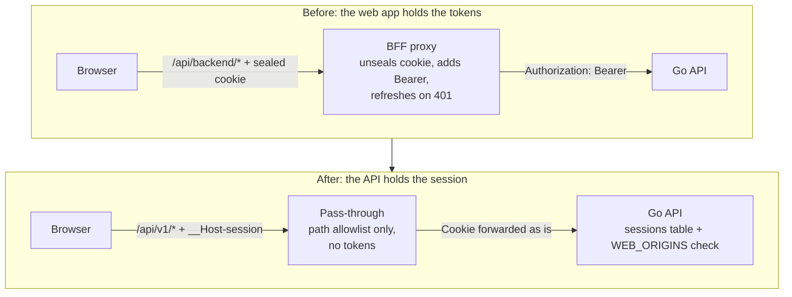

# Migrating a BFF app to cookie sessions

Moves an app scaffolded by `nuxt-scaffold` before v1.109.0 or `next-scaffold` before v1.110.0 off its token-holding BFF and onto the API's own cookie session. Nothing is automated: the scaffolds no longer ship the BFF, and a repo scaffolded earlier keeps its BFF files and its BFF rules, so you make the move by hand with this guide. Design and rationale: [`design/drop-bff.md`](design/drop-bff.md).

**An existing BFF app is not patched in place.** The known refresh race in the BFF (a sibling request's rotation can sign a user out) gets no interim fix; the apps move with this guide instead.

## Does this apply to you?

- **Yes:** a client-only (`ssr: false`) Nuxt or Next app, paired with a `go-scaffold` API, whose browser calls go to `/api/backend/*` and whose session is `nuxt-auth-utils` (Nuxt) or `iron-session` (Next).
- **No, Fastify API:** `nodejs-scaffold` has no cookie sessions, and adding them is out of scope. Those apps stay on the BFF.
- **No, server-rendered data:** the pass-through holds no session, so server code in the web app cannot read the user. An app that fetches the signed-in user's data during server rendering needs a different design.
- **Not affected:** `nuxt-marketing` apps (no auth) and the Flutter app (Bearer tokens, unchanged).

## What changes



| | Before | After |
|---|---|---|
| Browser calls | `/api/backend/v1/...` | `/api/v1/...` |
| Session | sealed cookie the web app owns | `__Host-session`, an opaque ID the API owns |
| Refresh | in the web app's proxy | none on the web; the session slides on the API |
| CSRF | the web app's middleware | the API: cookie mutations need an `Origin` in `WEB_ORIGINS` |
| Sign in / out | web app's own routes | `POST` / `DELETE /api/v1/auth/session` |
| Current user | `/api/me` | `GET /api/v1/user/profile` |
| Env | `NUXT_SESSION_PASSWORD` + `NUXT_BACKEND_URL` / `SESSION_PASSWORD` + `BACKEND_URL` | `NUXT_API_ORIGIN` / `API_ORIGIN` |

Every user signs in once at cutover, because the old sealed cookie means nothing to the API.

## Order of work

Upgrade the API first. Its change is additive (Bearer tokens keep working, so Flutter and the still-running BFF are unaffected), which makes each step below safe to ship on its own.

### 1. Upgrade the API

Cookie sessions arrived in `go-scaffold` v1.107.0 and the client-IP default in v1.108.0. A `go-scaffold` repo from before that has neither, and there is no patch block for it, because a rule describing code the repo does not have would be wrong. Scaffold a fresh API in a scratch directory with `go-scaffold` and port the difference:

- migration `000003_create_sessions_table`
- `internal/shared/httpx/session_cookie.go`, `internal/api/middleware/{auth,csrf,selector}.go`, the users module's `web_session` handlers, application and `session_repository` files, and the router and config wiring
- the `/auth/session` operations in `openapi.yaml`
- `SetTrustedProxies(nil)` in the router (v1.108.0), which closes a rate-limit bypass through `X-Forwarded-For`

Then set, in the API's real environment:

| Variable | Value |
|---|---|
| `WEB_ORIGINS` | the web app's exact origins, comma-separated: scheme, host and port, no path, no trailing slash, **no wildcard**. The API refuses to boot on `*` |
| `SESSION_IDLE_HOURS` / `SESSION_ABSOLUTE_DAYS` | defaults 72 and 30 |
| `SESSION_COOKIE_SECURE` | `true` everywhere except local development |
| `TRUSTED_PROXY` | leave unset (see [Client IP](#client-ip)) |

Check it before touching the web app: `POST /api/v1/auth/session` with a valid `Origin` returns 201 and a `Set-Cookie`, the same request with another `Origin` returns 403, and an existing Bearer login still works.

### 2. Swap the proxy for the pass-through

**Nuxt.** Take the files below from a fresh `nuxt-scaffold` app, which is the source of truth, rather than retyping them.

1. Remove `nuxt-auth-utils` from `dependencies` and `modules`.
2. Delete `server/api/backend/[...path].ts`, `server/utils/{backend,proxy}.ts`, `server/middleware/csrf.ts`, `shared/types/session.d.ts` and their tests. In a `saas` app also delete `server/api/{login,signup,logout,me}`, `server/middleware/auth.ts` and `server/utils/auth-flow.ts`.
3. Add `server/routes/api/[...path].ts`, `server/utils/pass-through.ts` and `tests/server/pass-through.test.ts`. The handler forwards only `/api/v<digits>/` to the origin, streams the answer back and returns a JSON 404 for any other `/api/*`.
4. In `nuxt.config.ts` set `ssr: false`, `nitro: { preset: 'cloudflare_module' }` and `runtimeConfig: { apiOrigin: '' }`. `NUXT_API_ORIGIN` fills `apiOrigin` and stays **server-only**: a `NUXT_PUBLIC_` name would ship the API's address to every browser.
5. Point the client at the pass-through: `$fetch.create({ baseURL: '/api', credentials: 'include' })`. Call sites keep their paths (`/v1/users`), since both clients forward the API's own paths.

**Next.**

1. `pnpm remove iron-session`.
2. Delete `src/app/api/backend/[...path]/`, `src/lib/{session,csrf,backend}.ts` and `src/proxy.ts`. In a `saas` app also delete `src/app/api/{login,signup,logout,me}` and `src/lib/auth-errors.ts`.
3. Add to `next.config.ts` a `rewrites()` returning `{ source: '/api/v:ver(\\d+)/:path*', destination: `${API_ORIGIN}/api/v:ver/:path*` }`, with `API_ORIGIN` read server-side only and validated as a bare origin. Copy it from a fresh `next-scaffold` app. Any other `/api/*` path matches nothing and is Next's 404.
4. Change the client's `baseUrl` from `/api/backend/api/v1` to `/api/v1` and set `credentials: 'include'`.
5. **`API_ORIGIN` is read at build time.** Next bakes a rewrite's destination into the build, so it must be set wherever `next build` runs. A runtime Worker variable set afterwards changes nothing, and changing the API origin means rebuilding.
6. Pin `next` to `16.3.8`. `create-next-app` 16.4.0 builds with OpenNext 1.20.9 but returns 500 for every non-rewrite request.
7. Moving from Vercel to Cloudflare is optional: `rewrites` work on any Next host. The scaffold's target is `@opennextjs/cloudflare@1.20.9` with `wrangler@^4`, an `open-next.config.ts`, a `wrangler.jsonc` and `preview` / `deploy` scripts, and `Set-Cookie` pass-through and streaming were checked only there. Deploy with `pnpm run deploy`; bare `pnpm deploy` is pnpm's own command.

### 3. Move the auth calls

The session endpoints live behind the pass-through, so the browser calls them directly:

| Action | Call |
|---|---|
| Sign in | `POST /api/v1/auth/session` with `{ email, password }`, 201 `{ user }` plus the cookie, 401 on bad credentials |
| Sign up | `POST /api/v1/auth/signup` with `{ email, password, full_name }`, then sign in: sign-up does not sign you in |
| Sign out | `DELETE /api/v1/auth/session` |
| Current user | `GET /api/v1/user/profile`, where a 401 means signed out |

Replace `useUserSession()` (Nuxt) or the iron-session reads (Next) with a small client composable or hook over those calls: `useAuth.ts` in `nuxt-scaffold`'s `saas` template, `features/users/hooks/use-session.ts` and `auth-gate.tsx` in `next-scaffold`'s. Treat only a 401 as "signed out"; a 5xx means the API is down, not that the visitor left. Route protection becomes client-side, because there is no server-side session to check: in Nuxt a global route middleware calling `fetchUser()`, in Next an `AuthGate`.

### 4. Remove the old env vars and set the origin

Delete `NUXT_SESSION_PASSWORD` and `NUXT_BACKEND_URL` (Nuxt), or `SESSION_PASSWORD` and `BACKEND_URL` (Next), from `.env`, `.env.example`, CI and the host. Then add:

| App | Variable | Where it is read |
|---|---|---|
| Nuxt | `NUXT_API_ORIGIN` | at runtime, as a Worker variable; unset gives a 502 `upstream_not_configured` from every `/api/v*` call |
| Next | `API_ORIGIN` | at build time, wherever `pnpm build`, `pnpm preview` or `pnpm run deploy` runs |

The value is the API's origin: scheme, host and optional port, no path or trailing slash.

**Do not expose the pass-through on the API's own domain for browsers.** A browser must reach the API only through the web app's own domain, or the cookie turns third-party and Safari blocks it.

### 5. Local development

`__Host-session` is a `Secure` cookie, and per MDN browsers require HTTPS for the `__Host-` prefix; this guide and the design did not test whether each browser exempts `http://localhost`. Either:

- run the app over HTTPS locally, for example `wrangler dev --local-protocol https`, keeping `SESSION_COOKIE_SECURE=true`, or
- set `SESSION_COOKIE_SECURE=false` on the **local** API only: the cookie is then named `session`, travels over plain HTTP, and the API logs a warning at boot. Never set it anywhere that serves real users.

If login returns 201 but the next request is a 401, the browser dropped the cookie: use one of the two.

### 6. Deploy and verify

Deploy the web app after the API. Check against the deployed origin:

```sh
# 201, and Set-Cookie: __Host-session=...; HttpOnly; Secure; SameSite=Lax; Path=/ with no Domain
curl -i -X POST https://app.example.com/api/v1/auth/session \
  -H 'Origin: https://app.example.com' -H 'Content-Type: application/json' \
  -d '{"email":"user@example.com","password":"..."}'
# 200 with the cookie, 401 without it
curl -i https://app.example.com/api/v1/user/profile -H 'Cookie: __Host-session=...'
# 404 JSON (Nuxt) or the 404 page (Next): the allowlist holds
curl -i https://app.example.com/api/other
```

The same `POST` with a different `Origin` must return 403. If it returns 201, `WEB_ORIGINS` is too permissive.

### 7. Update the repo's rules

A repo scaffolded before the release carries `.claude/rules/` files that describe the BFF (the proxy, the sealed session, `/api/backend`), and no patch block rewrites them, because a scaffolded repo still running its BFF needs rules that say so. After the move, edit them by hand to match the current `profile-nuxt.md` or `profile-next.md` in `bigin-harness-setup/references/`, deleting the BFF guidance.

## Rollback

The API change is additive, so rolling back is only a web redeploy.

1. Redeploy the previous web build. The BFF it contains authenticates with Bearer tokens, which the upgraded API still accepts.
2. Leave the API as it is. Sessions created in the meantime expire on their own, and the `sessions` table can stay.
3. Users sign in once more, since the old sealed cookie and `__Host-session` do not recognise each other.

So keep the old env vars in a secret store until the new deployment has been stable for a while, and delete them afterwards.

## Client IP

Behind the pass-through the API sees the web app's egress address as every browser user's address, so they share one rate-limit bucket. The pass-through forwards no `X-Forwarded-For` or `CF-Connecting-IP`, and a Worker subrequest to another zone arrives with a Cloudflare address in `CF-Connecting-IP` rather than the visitor's. Do **not** set `TRUSTED_PROXY=cloudflare` on the API to compensate: it would make the API trust a header the pass-through does not control. The fix (forwarding the visitor's IP in a header the API trusts, with the API origin locked to the Worker) needs a `go-scaffold` change and is not built; see [the polyrepo standard](polyrepo/SPEC-polyrepo-standard.md#browser-and-mobile-paths-to-the-api).

## Checklist

- [ ] API has cookie sessions (migration `000003` applied) and `WEB_ORIGINS` lists only the web app's exact origins
- [ ] A Bearer login on the API still works
- [ ] BFF proxy, session library, CSRF middleware and server-side auth routes deleted
- [ ] Pass-through added: `/api/v<digits>/` forwarded, anything else 404
- [ ] Client uses `/api` (Nuxt) or `/api/v1` (Next) with `credentials: 'include'`
- [ ] Sign-in, sign-up, sign-out and current-user calls use `/api/v1/auth/session`, `/api/v1/auth/signup` and `/api/v1/user/profile`
- [ ] Old env vars removed everywhere; `NUXT_API_ORIGIN` or `API_ORIGIN` set (Next: at build time)
- [ ] Local development works over HTTPS, or the local API sets `SESSION_COOKIE_SECURE=false`
- [ ] Deployed checks pass: cookie flags, 403 on a foreign `Origin`, 404 on `/api/other`
- [ ] Repo rules updated to describe the pass-through
