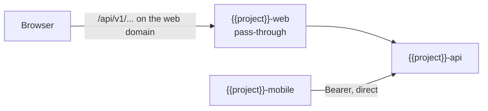

# REPO_MAP — {{project}}

<!-- Source of truth: {{project}}-specs/REPO_MAP.md. Synced to all repos by story_sync.mjs — do not edit synced copies. -->

## Repos

| Repo | Owner | Role |
|---|---|---|
| `{{project}}-specs` | BA | BMAD docs: PRD, architecture, epics, stories, qa gates. Source of this file. |
| `{{project}}-contracts` | dev | `openapi/<service>.v<major>.yaml` — the only place API specs are edited. Version files coexist; consumers pin per file. |
| `{{project}}-api` | dev | Go backend. Vendored spec, never edited here. |
| `{{project}}-web` | dev | Nuxt 4 webapp. Vendored spec + synced stories, never edited here. |
| `{{project}}-mobile` | dev | Flutter app. May pin an older contract version file than web. |
| `{{project}}-qa` | QA | Manual test cases, E2E automation, traceability to story IDs. |

## Where does task X go?

| Task | Repo (session opens there) |
|---|---|
| write / change a story, PRD, architecture | specs |
| add / change an API endpoint or schema | contracts (first, always) |
| implement backend behavior | api |
| implement web UI | web |
| implement mobile UI | mobile |
| write manual test cases or E2E | qa |
| link a Figma frame to a story | consumer repo — `docs/story-meta/<story>.yaml` |
| absorb a contract bump | consumer repo — merge the open sync PR |

## Flows

- **Contract change:** edit in contracts → PR (BE + FE approve) → merge → CI tags + dispatches → auto-PR in each consumer → dev merges when ready (`contract_sync.mjs bump`).
- **Story:** merge in specs → dispatch → auto-PR syncs `docs/stories/` to consumers via `story_sync.mjs`. Synced files carry `synced: true` and are read-only; dev context goes in `docs/story-meta/`.
- **Design:** frames come from the {{project}} fork of the design kit; dev pulls them via `flutter-figma-handoff` (mobile) or `nuxt-ui-figma-handoff` (web), using the node-id in the story sidecar.
- **Cross-stack story order:** contracts session → api / web / mobile sessions in parallel → qa session.

## Browser to API

- The browser reaches the API only through the web app's own `/api/v*` pass-through, so the session cookie stays first-party to the web domain. Never point browser code at the API's own domain.
- Flutter calls the API directly with Bearer tokens.
- The API's `WEB_ORIGINS` lists the web app's exact origins, no wildcard. The web app's `NUXT_API_ORIGIN` (Next: `API_ORIGIN`, set at build time) is the API's origin. Both are set per environment at deploy time.
- Behind the pass-through the API sees the web app's egress address as the client, so browser users share one rate-limit bucket.

## Rules that bite

- The vendored spec (`{{vendored-spec-path}}`) and `api-contract.lock` are written only by `contract_sync.mjs`. Need an API change? The task belongs to the contracts repo — stop and say so.
- Every PR references a story ID.
- A UI story (`ui: yes`) enters a sprint only when its sidecar has a Figma node-id and `status: final`.
- Breaking API changes open a new version file; the old file lives until: {{deprecation-window, e.g. "90 days after mobile release adoption"}}.

<!-- {{vendored-spec-path}} is resolved per repo, not per repo type. Each consumer
     records its own in api-contract.lock -> vendoredTo; `node scripts/contract_sync.mjs
     where` prints it. The per-type values below are only where a repo that has vendored
     nothing yet starts:
       api (go)        openapi.yaml          repo root
       web (nuxt)      openapi.yaml          repo root
       mobile (flutter) api/openapi.yaml
     See SPEC-contract-sync.md §6 and contract-sync/references/lock-format.md. -->

## Local dev

Full stack locally: `docker-compose` in `{{project}}-api` (api + postgres); frontends point at it or at the shared tunnel URL: {{tunnel-url}}.

`gh` is a prerequisite in every consumer repo — `contract_sync.mjs` resolves its token from `GITHUB_TOKEN`, then `gh auth token`.
