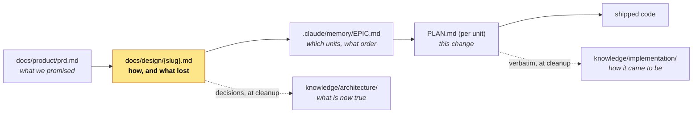
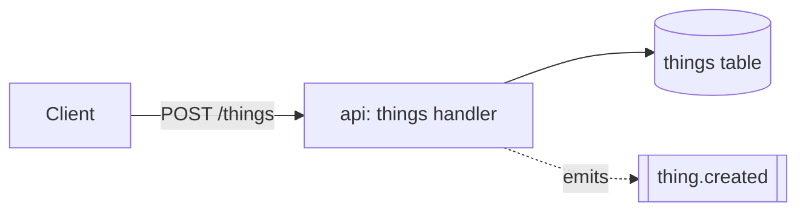

# The epic design doc

One page that says *how* an initiative is being built and what was rejected, written at the
decomposition gate and living at `docs/design/{slug}.md`.

It fills the one gap between the artifacts this harness already has. `docs/product/prd.md`
says what we promised a user. `PLAN.md` says how one unit is built, and dies at cleanup.
`knowledge/` says what is invariably true *after* the dust settles. Nothing held the
system-level reasoning at the moment it was decided — which options lost, what forced the
shape, which risks were accepted — so it survived only in merged PR descriptions, if at all.



The highlighted box is the only new artifact; everything around it already exists.

## When to write one, and when not

Write one when **two or more** of these hold:

- the epic introduces or changes a contract, a module boundary, or a data shape that more
  than one unit depends on;
- there is a real choice with more than one defensible answer;
- the ordering of units rests on a technical judgement a reader would otherwise have to
  reconstruct from the queue;
- it spans more than one repo or surface.

**Skip it when the shape is obvious, when every unit follows a pattern the repo already
has, or when the doc would read as an implementation manual rather than a discussion of
trade-offs.** That last test is the sharp one: if writing it produces a list of files to
change, the decomposition already carries that, and the doc is ceremony.

Skipping is a normal outcome — but **say in one sentence that you skipped it and why**,
in the same message as the decomposition. A silent skip is indistinguishable from
forgetting, and it is the failure this reference exists to prevent.

## The template

Copy this into `docs/design/{slug}.md`, slug from the epic's title — the same slug the
`EPIC.md` archive uses, so the two are greppable together.

````markdown
# Design: {epic title}

- **Status:** draft | approved | superseded by {link}
- **Epic:** `.claude/memory/EPIC.md` → {slug}
- **PRD:** docs/product/prd.md → FR-{ids}, or "none — no PRD for this initiative"
- **Date:** {YYYY-MM-DD}

## Context and scope

What exists now, what this changes, and what is deliberately out of frame. Three
paragraphs at most. A reader who knows the product but not this corner of the code
should be able to stop here and still follow the rest.

## Goals and non-goals

- **Goals** — what this initiative must achieve, in terms that can be checked.
- **Non-goals** — the load-bearing half. What a reasonable reader would assume is
  included, and is not.

## Design

**Open with a `mermaid` diagram** — this document is read by people, and the shape of a
system lands in one picture faster than in three paragraphs. A `flowchart` for components
and data flow, a `sequenceDiagram` when the order of calls is the point, an
`erDiagram` when the data shape is. Then the prose: the contracts touched, the data
shapes, and which parts are **forced** (by an existing contract, a platform limit, a
decision already in `knowledge/`) versus **chosen** — a reader cannot argue with the
design until they know which is which.



## Alternatives considered

At least one real alternative, with why it lost. "None" is an answer only when the design
was forced; then say what forced it and delete this section's other bullets.

## Cross-cutting concerns

Security and privacy · observability · performance budget · migration and rollout ·
failure modes. Omit one only by writing `n/a — {reason}`; a heading that is simply absent
reads as unconsidered.

## Risks

Each technical risk with **the signal that would tell you it is happening**. A risk with
no trigger is a worry, not a risk.

## Open questions

Each with an owner and a by-when. Without those it is not open, it is ignored.
````

Diagrams are not decoration here: a human-facing document in this repo carries at least
one `mermaid` block wherever it describes a structure, a flow, or a sequence, because the
alternative is a reader rebuilding the picture in their head and getting it wrong.

**Length: one to three pages**, diagrams included. Past that, either the initiative is a roadmap — step 3's
~8-unit ceiling already says to slice it — or the doc has drifted into an implementation
manual.

## What it is not

| Not this | Which lives at | Difference |
| --- | --- | --- |
| A PRD | `docs/product/prd.md` | product contract, written by `discovery-workflow`, never amended here |
| A `PLAN.md` | repo root, per unit | one unit's how, gated by `spec-gate-guard.mjs` |
| A `knowledge/` concept | `knowledge/architecture/` | what is invariably true *now*; this is the reasoning *then* |

## At epic cleanup: decisions become records

The design doc **stays** in `docs/design/` and is updated when reality diverges from it —
it is the entry point for whoever touches this system next, which is the whole reason it
outlives the epic. It is not archived alongside `EPIC.md`.

What does move: each decision the doc actually settled becomes one file under
`knowledge/architecture/`, in the shape below, proposed at step 10 like every other
`knowledge/` edit. Use it as-is; it is [MADR 4.0.0](https://adr.github.io/madr/), dual
MIT/CC0, so it can be copied verbatim.

```markdown
---
status: accepted
date: {YYYY-MM-DD}
deciders: {roles, never names}
---

# {short present-tense title of the decision}

## Context and Problem Statement

{Two or three sentences, or a question.}

## Decision Drivers

* {driver}

## Considered Options

* {option}

## Decision Outcome

Chosen option: "{option}", because {justification}.

### Consequences

* Good, because {consequence}
* Bad, because {consequence}
```

Keep the split honest: the record holds the *invariant* ("rate limits are per-key, not
per-IP"), the design doc holds the *narrative* that produced it. A concept that recounts
the epic, or a design doc that is only a list of invariants, means one was written in the
wrong place.

## Sources

- [Design Docs at Google](https://www.industrialempathy.com/posts/design-docs-at-google/)
  — the section structure above, and the rule for when not to write one. Prose, not a
  licensed template; the wording here is ours.
- [MADR 4.0.0](https://adr.github.io/madr/) — the decision-record shape, MIT/CC0, copied.
- [arc42](https://arc42.org/overview) — the twelve-section whole-system template, CC BY-SA
  4.0. Referenced for the rare system-wide document; deliberately **not** copied, because
  share-alike would follow it into this file.
